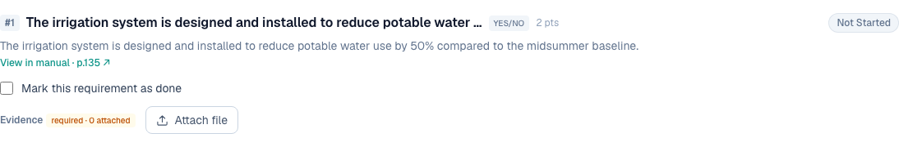
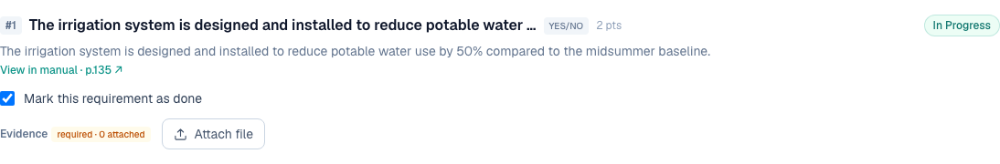
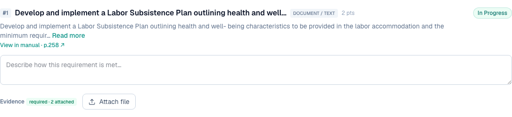

# 1 — Evidence upload must not be labelled "Optional"

**Type:** Feature / Correction · **Verdict:** Confirmed · **Effort:** XS

## As raised

> Evidence upload should not be marked "Optional." Wherever the platform
> currently labels evidence upload as optional, it should be changed to
> mandatory/required.

## What the audit found

The label is real. On credit W-02 the evidence row reads `Evidence (optional)`
next to the Attach file button.

The label is not a hardcoded string — it is driven by whether the parser found a
list of required evidence documents for that requirement. In the seeded
Commercial D+C catalog:

| Requirements | Count |
|---|---|
| Total | 99 |
| With a parsed evidence list, shown as "required" | 93 |
| With an empty evidence list, shown as "(optional)" | 6 |

The six sit in four credits: E-04, HC-16, MW-06 and W-02 (3 of its 5).

## Root cause

`requiresEvidence` is derived as "the extract listed at least one evidence
document". Where the parser returned an empty list, the app concludes evidence
is optional. That is a parser gap being presented to the user as a policy
statement. Mostadam requires evidence for every credit being claimed.

Two files are involved: the label in the requirement row component, and the
derivation in the data layer. The derived-status rule also treats those six
requirements as completable with no file at all, which is the more serious half
of this bug.

## Proposed change

1. Change the label from "(optional)" to "required" everywhere.
2. Flip the default so a requirement with no parsed evidence list is still
   treated as requiring evidence, rather than the reverse.
3. Keep showing the parsed document list where one exists (see item 9).

Because the status engine keys off the same flag, this change also stops those
six requirements from being marked complete with nothing attached.

---

## Done — 2026-09-04

Evidence is now required on every requirement. The word "optional" no longer
appears against evidence anywhere in the product.

Two changes, and the second matters more than the label:

1. **The label.** The requirement row always renders `required · N attached`.
   The badge is amber at zero files and turns green once something is attached,
   so the state is readable at a glance rather than being a number to parse.
2. **The derivation.** `requiresEvidence` in the data layer was
   `evidenceSpecs.length > 0`, meaning a requirement whose evidence table failed
   to extract from the manual was treated as needing no evidence at all. It is
   now unconditionally true. The parsed list still drives *which* documents are
   named; it no longer decides *whether* a file is needed.

The flag is kept rather than deleted, because the scoring engine reads it and it
is the seam where a future rating system could differ.

### The consequence worth noting

Six requirements across E-04, HC-16, MW-06 and W-02 could previously be marked
complete with no file attached. They no longer can. This will move those
requirements from Completed back to In Progress on any project where they were
closed that way, and the workspace "Missing Evidence" count rises accordingly.
That is the bug being fixed, not a regression.

### Verified

The exact requirement from the before-screenshot, W-02 #1, now reads "required":

Ticking it with no file attached leaves it In Progress instead of Completed:

The badge once files are attached, on PMM-03:

| Check | Result |
|---|---|
| No "(optional)" on W-02 | pass |
| All 5 W-02 requirements read "required · N attached" | pass |
| No "(optional)" on E-04, HC-16, MW-06 | pass |
| PMM-03 still reads "required · 2 attached" | pass |
| Ticked-but-fileless requirement is not Completed | pass, stays In Progress |

A repo-wide search confirms the only remaining "optional" is in the project
wizard subtitle, about which wizard steps are mandatory, unrelated to evidence.
