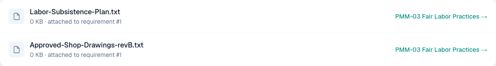
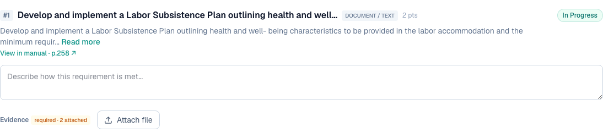

# 2 — Multiple attachments per credit, with upload and remove

**Type:** Feature · **Verdict:** Already works in storage, invisible in the UI · **Effort:** S

## As raised

> The system must support multiple attachments per credit, not a single file
> only. Upload and remore option should be there

## What the audit found

Multiple attachments already work. Two different files were uploaded to the same
requirement on PMM-03 during the audit. Both were written to disk, both created
database rows, and both appear in the project's Evidence Library.

What the credit screen shows after those two uploads is a counter and nothing
else.

The evidence table is already a one-to-many relation keyed on the requirement
entry, so nothing in the schema limits a requirement to one file. There is no
storage work to do here.

## Root cause

The requirement row renders `required · N attached` and never renders the list
of files behind that number. The reporter had no way to tell whether a second
upload replaced the first or was added alongside it.

## Proposed change

Render the attachment list under each requirement: filename, size, upload date,
a download link and a remove button. This is the same component that closes
items 3, 4, 5, 10 and 13.

Serving the file back also needs a new route. Nothing in the product currently
returns an uploaded evidence file to the browser, so a download link has nothing
to point at yet.
