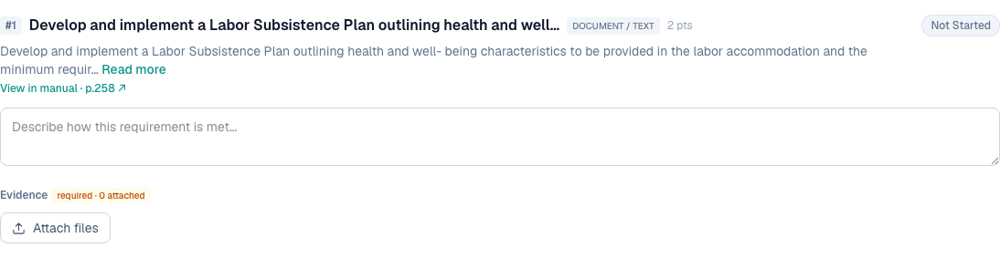

# 3 — "Additional Attachments" option for shop drawings and similar

**Type:** Feature · **Verdict:** Same fix as item 2 · **Effort:** XS

## As raised

> For approved shop drawings (and similar document uploads), there should be an
> "Additional Attachments" option.

## What the audit found

Each requirement offers exactly one control, labelled "Attach file". It accepts
a single file per click and gives no indication that it can be used again.

Pressing it a second time does work and does add a second file. Nothing on the
screen says so.

## Root cause

Wording and affordance, not capability. A control labelled "Attach file" sitting
next to a bare count reads as a one-shot action.

## Proposed change

Once the attachment list from item 2 is in place, the control below the list
becomes "Add attachment" and stays visible whether or not files are already
present. Allow selecting several files in one go rather than one per click.

The client's phrase "Additional Attachments" describes the section heading they
expect. Naming the block "Attachments" with an "Add attachment" action underneath
matches the intent without inventing a second, separate upload slot.

---

## Done — 2026-09-04

The add control now sits under the attachment list and stays there at every
state, so adding more documents to an approved shop drawing or any other
requirement is always an available action.

Its label changes with the state, which is what makes the affordance readable:

| State | Label |
|---|---|
| No files yet | Attach files |
| One or more attached | Add attachment |

Empty:

With files present, the control reads "Add attachment" beneath the list:

The input also accepts a multiple selection, so "additional attachments" does
not mean one click per file.

### Verified

| Check | Result |
|---|---|
| Control reads "Attach files" when empty | pass |
| Control reads "Add attachment" once files exist | pass |
| Control remains visible with files attached | pass |
| A two-file selection attaches both | pass |
