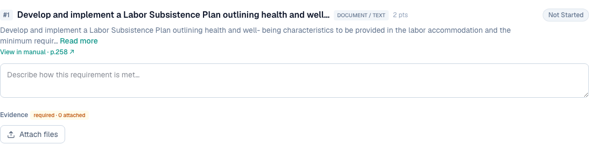
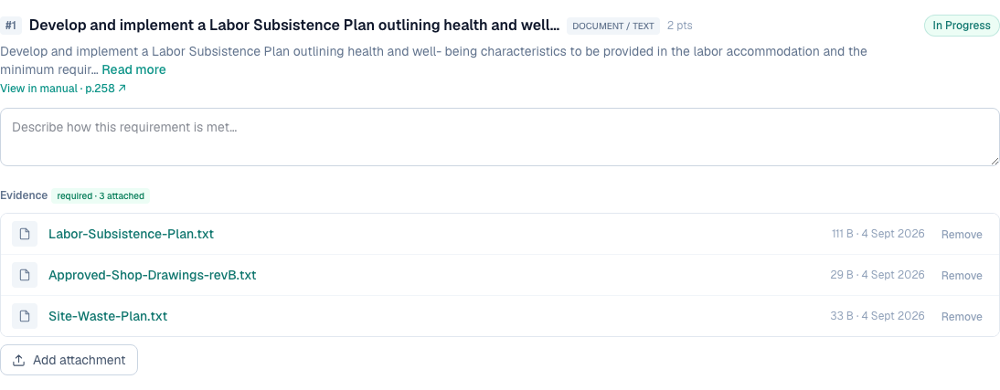
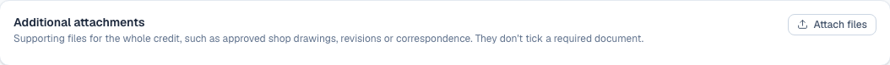
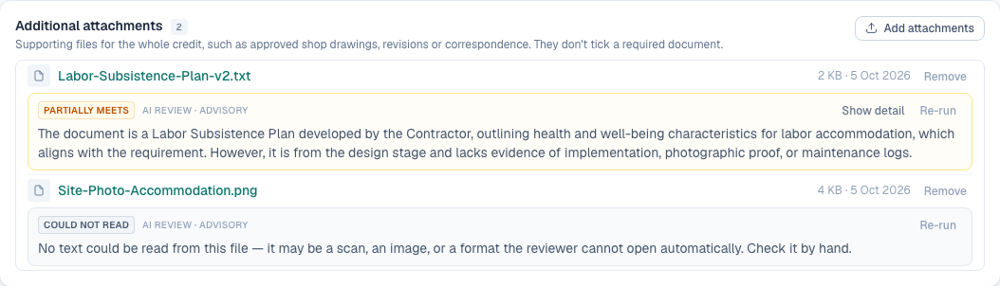
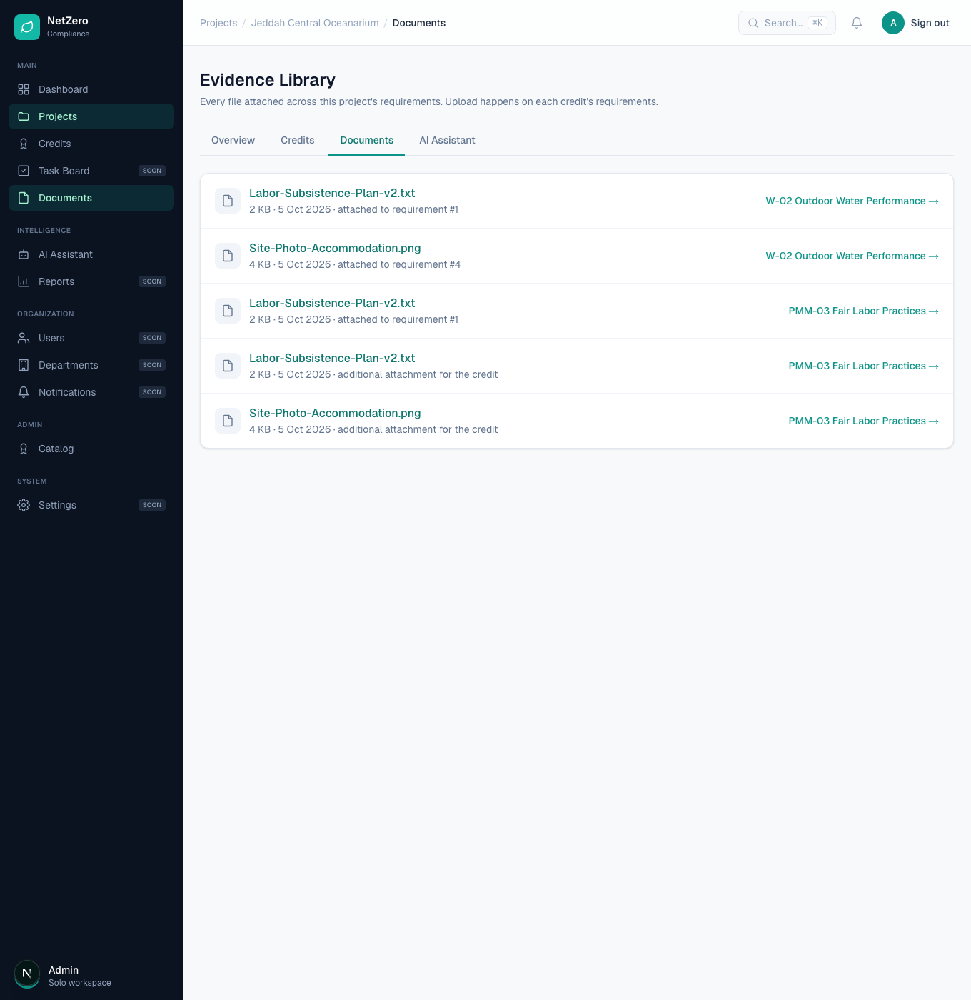

# 3 — "Additional Attachments" option for shop drawings and similar

**Type:** Feature · **Verdict:** Same fix as item 2 · **Effort:** XS

## As raised

> For approved shop drawings (and similar document uploads), there should be an
> "Additional Attachments" option.

## What the audit found

Each requirement offers exactly one control, labelled "Attach file". It accepts
a single file per click and gives no indication that it can be used again.

Pressing it a second time does work and does add a second file. Nothing on the
screen says so.

## Root cause

Wording and affordance, not capability. A control labelled "Attach file" sitting
next to a bare count reads as a one-shot action.

## Proposed change

Once the attachment list from item 2 is in place, the control below the list
becomes "Add attachment" and stays visible whether or not files are already
present. Allow selecting several files in one go rather than one per click.

The client's phrase "Additional Attachments" describes the section heading they
expect. Naming the block "Attachments" with an "Add attachment" action underneath
matches the intent without inventing a second, separate upload slot.

---

## Done — 2026-09-04

The add control now sits under the attachment list and stays there at every
state, so adding more documents to an approved shop drawing or any other
requirement is always an available action.

Its label changes with the state, which is what makes the affordance readable:

| State | Label |
|---|---|
| No files yet | Attach files |
| One or more attached | Add attachment |

Empty:

With files present, the control reads "Add attachment" beneath the list:

The input also accepts a multiple selection, so "additional attachments" does
not mean one click per file.

### Verified

| Check | Result |
|---|---|
| Control reads "Attach files" when empty | pass |
| Control reads "Add attachment" once files exist | pass |
| Control remains visible with files attached | pass |
| A two-file selection attaches both | pass |

### Final shipped appearance

Row 9 landed after this one and folded the attachment list into a
required-documents checklist, so the screen now looks like this. Files sit under
the document they provide, with unassigned ones grouped as "Other attachments".
Everything verified above still holds.

## Done — 2026-10-05 (V2 feedback: a labelled section)

The V2 log left this row unmarked. The Sprint 1 answer, a multi-file control on
every requirement, did not read as the "Additional Attachments" option the
client asked for. Hadi's call: a labelled section of its own, at credit level.

### What changed

The credit page now has an **Additional attachments** card, directly under
Required documents.

- **Credit-level.** Files belong to the credit as a whole, not to one
  requirement: approved shop drawings, revisions, correspondence. Several files
  can be picked at once.
- **Never counts toward completion.** These files never tick a required
  document and never move a requirement's status. In the check below,
  Required documents stayed at "1 of 5" after two additional files were added.
- **Reviewed against the whole credit.** The AI reviewer has no single
  requirement to read them against, so it reads them against all the credit's
  requirements, with their expected documents combined.
- **Same file handling as requirement evidence.** Download, remove and re-run
  review all work as they do for requirement files.
- **Documents library.** These files are listed as "additional attachment for
  the credit".

The per-requirement "Other files" slot from Sprint 1 is still there, for a file
that supports one requirement without being a listed document.

### Data

Migration `0005` makes two changes to `evidence_doc`:

- adds `project_credit_id`, added nullable, backfilled from each file's
  requirement entry, then set NOT NULL;
- makes `requirement_entry_id` nullable. A null value now means "credit-level".

On the test database all 3 existing files backfilled to the right credit.

Uploads re-read the credit from the database, scoped to the project, rather than
trusting the posted id. A credit-level upload can never claim a requirement's
document slot.

### Checks

- **Browser** (PMM-03, project "Jeddah Central Oceanarium"):
  - the card sits between Required documents and the checklist;
  - a two-file upload attaches both;
  - the AI review rendered: "partially meets" for the plan, "could not read"
    for the photo;
  - download returns 200;
  - the documents library shows both files labelled as the credit's;
  - remove deletes one and leaves the other;
  - no console errors, no 5xx.
- **Database tests:** `tests/evidence-credit-level.test.ts` covers three things:
  - credit-level files stay apart from requirement evidence;
  - they never satisfy a requirement;
  - the library lists them with no requirement.
- **Unit test** for the credit-level review prompt.
- 108 passing with the database tests on; `tsc` clean; lint has no errors (the
  5 existing warnings are untouched).
