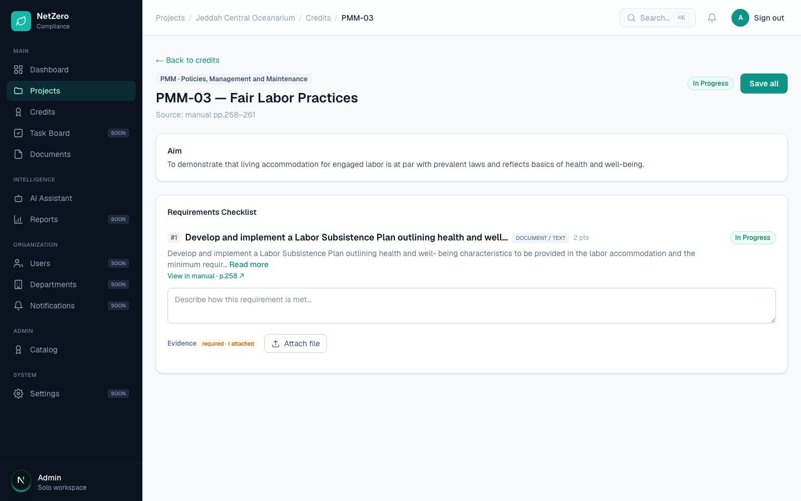
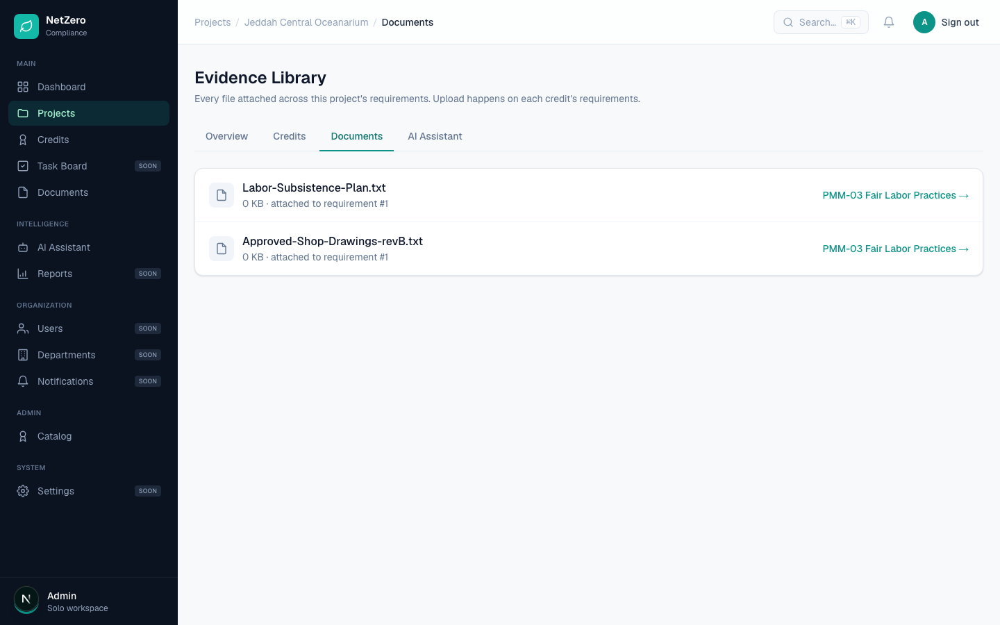

# 4 — Labor Subsistence Plan attached to PMM-03 never appears

**Type:** Bug · **Verdict:** Confirmed, with an important correction · **Effort:** S

## As raised

> Attempted to attach the Labor Subsistence Plan to credit PMM-03 (Fair Labor
> Practices) — the file did not shown after uploading, and no attachment is
> visible/confirmed after upload.

## What the audit found

The scenario was reproduced exactly. PMM-03 was opened on a fresh project and a
file named `Labor-Subsistence-Plan.txt` was attached to requirement 1.

Before the upload:

After the upload, and again after a full page reload:

The filename appears nowhere on the page. The requirement row closeup shows what
does change:

**The file is not lost.** The counter moved from `0 attached` to `1 attached`,
the file was written to disk, a database row was created, and the file is listed
in the project's Documents tab.

## Root cause

Not an upload failure. The upload path works. The credit screen has no
attachment list, so the only feedback a user gets is a number changing inside a
small badge that is easy to miss. From the user's seat this is indistinguishable
from a silent failure, and the report was a reasonable reading of what they saw.

A second factor makes it worse: even in the Documents tab the filename is plain
text with no link. There is no route in the application that serves an uploaded
evidence file, so a user cannot open the file to confirm what was stored.

## Proposed change

1. List attachments under the requirement immediately after upload: filename,
   size, timestamp.
2. Add a route that serves an evidence file, scoped to the workspace, and link
   each filename to it.
3. Show a brief confirmation when an upload completes.

Items 2, 3, 5, 10 and 13 are all closed by the same work.
