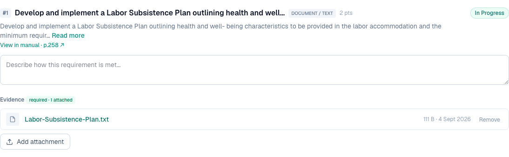

# 4 — Labor Subsistence Plan attached to PMM-03 never appears

**Type:** Bug · **Verdict:** Confirmed, with an important correction · **Effort:** S

## As raised

> Attempted to attach the Labor Subsistence Plan to credit PMM-03 (Fair Labor
> Practices) — the file did not shown after uploading, and no attachment is
> visible/confirmed after upload.

## What the audit found

The scenario was reproduced exactly. PMM-03 was opened on a fresh project and a
file named `Labor-Subsistence-Plan.txt` was attached to requirement 1.

Before the upload:

After the upload, and again after a full page reload:

The filename appears nowhere on the page. The requirement row closeup shows what
does change:

**The file is not lost.** The counter moved from `0 attached` to `1 attached`,
the file was written to disk, a database row was created, and the file is listed
in the project's Documents tab.

## Root cause

Not an upload failure. The upload path works. The credit screen has no
attachment list, so the only feedback a user gets is a number changing inside a
small badge that is easy to miss. From the user's seat this is indistinguishable
from a silent failure, and the report was a reasonable reading of what they saw.

A second factor makes it worse: even in the Documents tab the filename is plain
text with no link. There is no route in the application that serves an uploaded
evidence file, so a user cannot open the file to confirm what was stored.

## Proposed change

1. List attachments under the requirement immediately after upload: filename,
   size, timestamp.
2. Add a route that serves an evidence file, scoped to the workspace, and link
   each filename to it.
3. Show a brief confirmation when an upload completes.

Items 2, 3, 5, 10 and 13 are all closed by the same work.

---

## Done — 2026-09-04

The credit screen lists its attachments. The exact scenario from the report was
replayed: PMM-03 requirement 1, empty, then the Labor Subsistence Plan attached.
The filename now appears straight away.

Before, empty:

Immediately after the upload, with no reload:

With three files attached, each openable and removable:

### The shared work

One component, `components/AttachmentList.tsx`, renders the files attached to a
requirement: name, size, upload date, a link that opens the file, and a Remove
button, with an add control underneath that stays visible whether or not files
are present.

Three supporting pieces landed with it:

- **`GET /api/evidence/[docId]`** serves a stored file. Nothing in the product
  did before, so no attachment could be opened anywhere. It requires a session
  and matches on the caller's workspace as well as the id. Only known-safe types
  render inline; everything else downloads, with `X-Content-Type-Options:
  nosniff`, so an uploaded `.html` or `.svg` cannot execute against this origin.
- **`uploadEvidence`** accepts several files in one submission instead of one.
- **`deleteEvidence`** removes the row and then the file on disk, looked up by
  id and workspace together.

The data layer carries the attachment rows through to the requirement view
rather than just a count.

This one change closes rows 2, 3, 5, 10 and 13 as well.

### Verified

| Check | Result |
|---|---|
| Requirement starts empty, control reads "Attach files" | pass |
| Filename appears immediately after upload, no reload | pass |
| It survives a reload | pass |
| The file downloads with its real content | pass, 200 |
| Three files listed after a two-file selection | pass |
| Control changes to "Add attachment" once files exist | pass |
| Removing one leaves the other two | pass |
| Badge follows the count throughout | pass, 0 → 1 → 3 → 2 |
| Unknown evidence id is refused | pass, 404 |
| Evidence is not served without a session | pass, 401 |
| Documents tab lists the same files as links | pass |

### Final shipped appearance

Row 9 landed after this one and folded the attachment list into a
required-documents checklist, so the screen now looks like this. Files sit under
the document they provide, with unassigned ones grouped as "Other attachments".
Everything verified above still holds.

