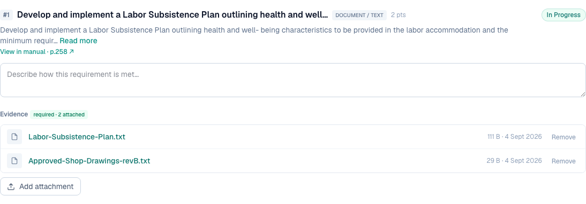
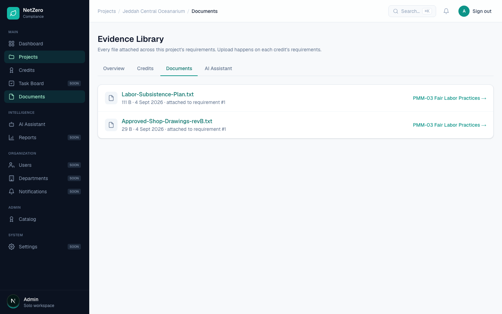
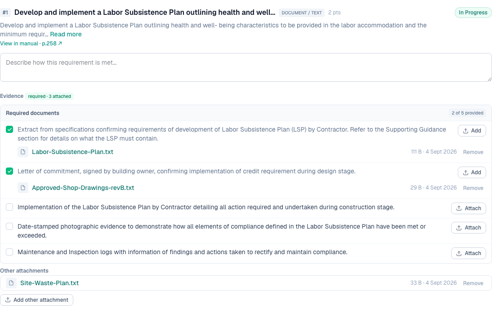

# 5 — Remove an attached file so superseded versions do not pile up

**Type:** Feature · **Verdict:** Confirmed missing · **Effort:** S

## As raised

> Need a removal/delete option for attached files, so outdated versions can be
> removed when replaced with updated ones instead of accumulating and consuming
> storage.

## What the audit found

There is no delete control anywhere in the product. Not on the credit screen:

And not in the project's Evidence Library, where the files are listed but carry
no actions at all:

A scripted search of both screens for any control matching "remove" or "delete"
returned zero matches.

## Root cause

Never built. The upload path writes a file and inserts a row; there is no
counterpart that removes either one.

## Proposed change

Add a remove action on each attachment in the list from item 2. It deletes the
database row and the file on disk.

Two decisions worth settling before building:

- **Hard delete or soft delete.** This is compliance evidence. A superseded
  revision that was already cited in a submission may need to remain
  retrievable. A soft delete with an "archived" state keeps the credit screen
  clean while preserving the audit trail. It does not, however, free storage,
  which is the reason the client gave for asking.
- **Who may delete.** Single-workspace today, so anyone can. Worth revisiting
  when roles land.

Recommendation: hard delete for now, matching the stated intent, and revisit if
an audit-trail requirement appears.

---

## Done — 2026-09-04

Every attachment now carries a Remove action. It deletes the database row and
then the file on disk, so a superseded revision stops consuming storage, which
was the reason given for the request.

Three files attached, each with its own Remove:

After removing the superseded plan, the other two are untouched:

The project Evidence Library reflects the same state, since both screens read
the same rows:

### Decisions taken

- **Hard delete, not soft.** The audit noted the tension: compliance evidence
  that was already cited may be worth keeping, but the client asked for this
  specifically to stop files accumulating and consuming storage, and a soft
  delete would not free anything. Hard delete matches the stated intent. If an
  audit-trail requirement appears later this is the place to revisit.
- **Confirm before deleting.** The button asks first, since the file is gone
  afterwards.
- **A missing file on disk is not an error.** The row is still removed, because
  leaving it behind would strand an entry the user cannot get rid of.
- **Scoped by workspace.** The row is looked up by id *and* workspace, so a
  crafted request cannot reach another workspace's file.
- **Anyone in the workspace may delete.** There is one role today. Worth
  revisiting when roles land.

### Verified

| Check | Result |
|---|---|
| Every attachment has a Remove control | pass |
| Removing one leaves the others intact | pass |
| Badge drops with the removal | pass, 3 → 2 |
| The Documents tab drops it too | pass, 2 links |
| Unknown evidence id is refused | pass, 404 |

### Final shipped appearance

Row 9 landed after this one and folded the attachment list into a
required-documents checklist, so the screen now looks like this. Files sit under
the document they provide, with unassigned ones grouped as "Other attachments".
Everything verified above still holds.

