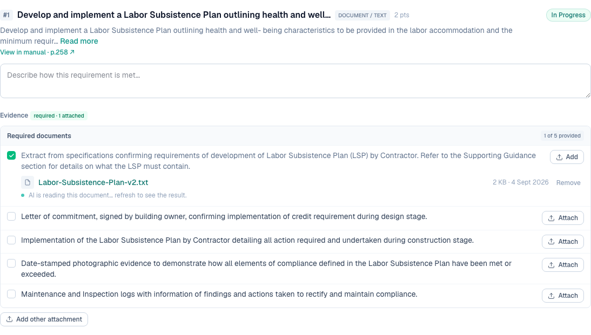
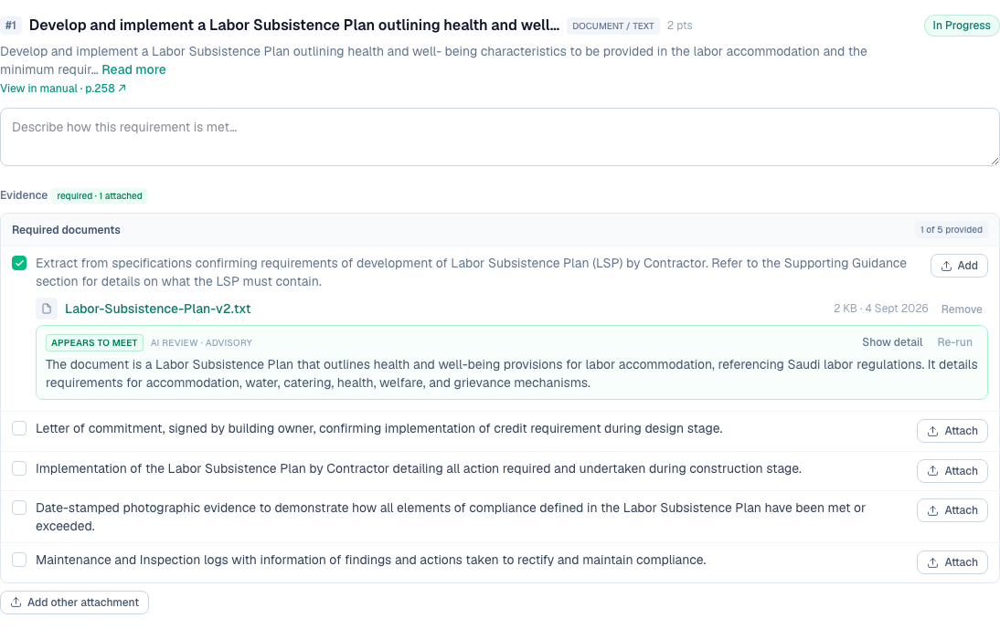
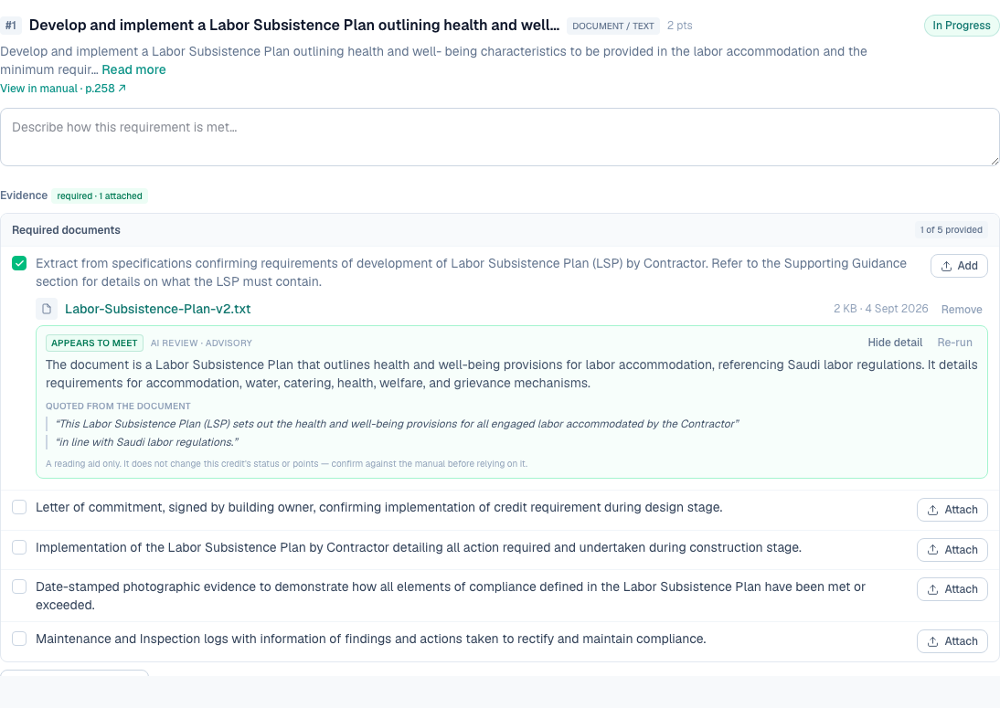
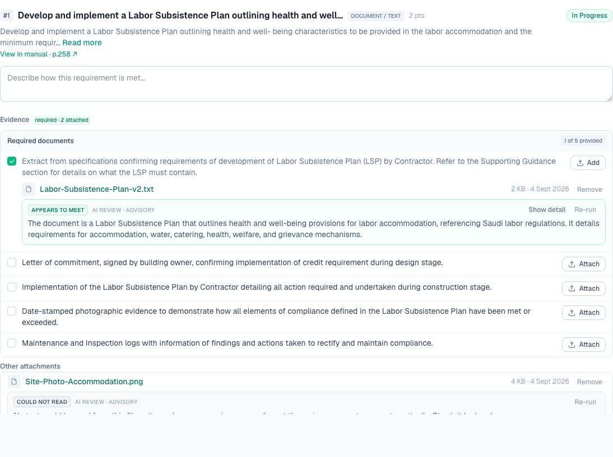

# 6 — AI review of an uploaded document against the credit requirement

**Type:** Feature · **Verdict:** Not built · **Effort:** L

## As raised

> After a document is uploaded, the AI should automatically review the full
> document against the relevant credit's requirements. Specifically for plans
> (e.g. Labor Subsistence Plan), it should assess and flag whether the plan meets
> or does not meet the credit requirement.

## What the audit found

Uploading a document produces no analysis of any kind. The upload writes a file,
inserts a row, and refreshes the page.

## What already exists to build on

This is the largest item on the list, but not a greenfield one.

- A PDF text extractor is already a dependency and is used by the manual parser.
- A language-model client with a JSON-mode helper and a deterministic fallback
  is already in place, along with a working example that generates grounded
  reviewer notes for the catalog export.
- The requirement text, its aim, its metric type and its list of expected
  evidence documents are all in the database and are exactly what a reviewer
  would compare a plan against.

What is missing is the pipeline: extract text from the uploaded file, chunk it,
prompt against the requirement, store a verdict, and surface it.

## Proposed change

A queued review that runs after upload and stores, per attachment: a verdict of
met / partially met / not met / unreadable, a short rationale, and quotes from
the document supporting the verdict.

Constraints worth writing into the spec now:

- **Advisory, never authoritative.** The verdict must not drive credit status.
  The existing status engine is derived from user-entered values and file
  presence, and an AI opinion must not silently change a compliance state. Show
  it as a reviewer aid the user can accept or dismiss.
- **Cite or stay silent.** Every claim should quote the document. The house rule
  established in the catalog parser work is that the model normalises and
  assesses, it does not invent thresholds or point values.
- **Handle the unreadable case.** Scanned drawings and image-only PDFs will not
  yield text. Say so plainly rather than guessing.
- **Asynchronous.** A full plan will not review inside a form submission. Upload
  must stay fast, with the verdict arriving after.

Recommend scoping this as its own slice after the quick wins land.

---

## Done — 2026-09-04

Uploading a document now triggers an AI read of it against the requirement it
was attached to, exactly the Labor Subsistence Plan case the client named.

The upload itself is unaffected. A pending row is written straight away and the
model call is scheduled with Next's `after()`, so it runs once the response has
been sent rather than holding the form:

The verdict, on a real Labor Subsistence Plan reviewed against PMM-03:

Expanded, showing the quotes the verdict rests on:

### The constraints from the audit, and how each was honoured

- **Advisory, never authoritative.** Nothing the model returns is written to
  requirement or credit status. Status stays derived from the values entered and
  the files present. The badge says "AI review · advisory" and the expanded
  panel states plainly that it does not change the credit's status or points.
  The QA asserts the credit did not move to Completed on the back of a verdict.
- **Cite or stay silent.** Every claim must carry a verbatim span from the
  document. Both quotes returned in the QA run matched the source file exactly,
  checked by string comparison against the uploaded text rather than by eye.
- **Handle the unreadable case.** Text extraction happens before the model is
  called. A scan, an image or a format with no extractor returns "Could not
  read" and says to check it by hand. A PDF yielding under 200 characters counts
  as unreadable rather than being reviewed as whitespace.

  

- **Asynchronous.** As above, via `after()`.

### How it works

- `lib/ai/evidence-review.ts` extracts the text, builds a prompt from the
  requirement text plus its expected-documents list, calls the existing
  OpenRouter client in JSON mode, and normalises the answer.
- When the upload claimed a specific required document (row 9), the review
  judges against that document alone; otherwise against the whole list.
- One row per file in the new `evidence_review` table, migration `0003`.
- Text is capped at 24,000 characters per call, and the prompt says so when
  truncated rather than pretending it read everything.
- A "Re-run" action re-reads a file after a document is replaced or a call fails.

### Guarding the model's output

`normalizeReview` coerces whatever comes back into the five verdicts the UI can
render. Anything unrecognised becomes "unclear" rather than a guess, so a model
answering "probably fine" can never be displayed as "meets". The model is also
not allowed to declare a document unreadable — that is the extractor's call.
Seven unit tests in `tests/evidence-review.test.ts` cover casing drift, missing
fields, wrong-shaped arrays and runaway output.

### Verified

| Check | Result |
|---|---|
| Upload is not blocked by the review | pass |
| A pending state appears immediately | pass |
| A verdict arrives | pass, "Appears to meet" |
| The review is labelled advisory | pass |
| The credit status did not move | pass |
| Quotes are verbatim from the uploaded document | pass, 2 of 2 matched |
| The advisory disclaimer is shown in the detail | pass |
| An unreadable file says so rather than guessing | pass |

### Follow-up left open

- The review runs in the web process. That is fine for one document at a time on
  Railway; a real queue is worth having before bulk uploads.
- Only PDFs and plain-text formats are extractable today. Office documents and
  scanned drawings report "Could not read". OCR and a DOCX extractor are the
  obvious next additions, and both are additive to this pipeline.
