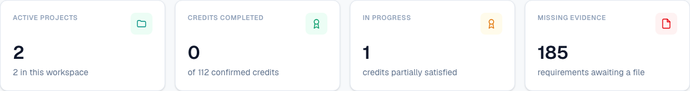
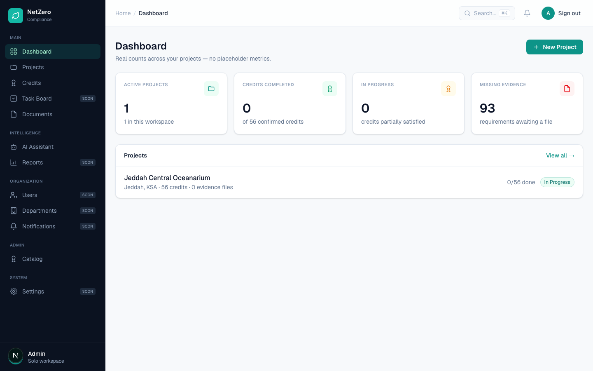
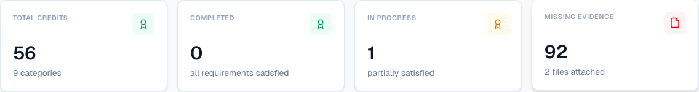
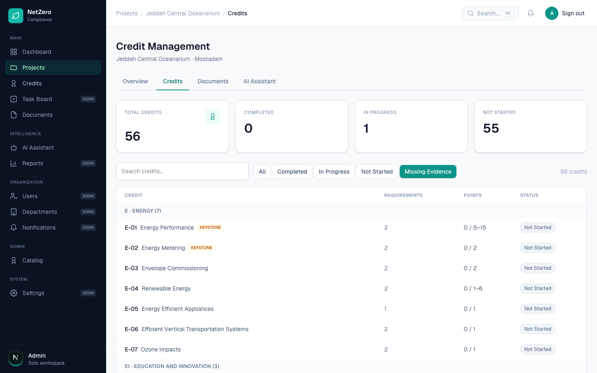
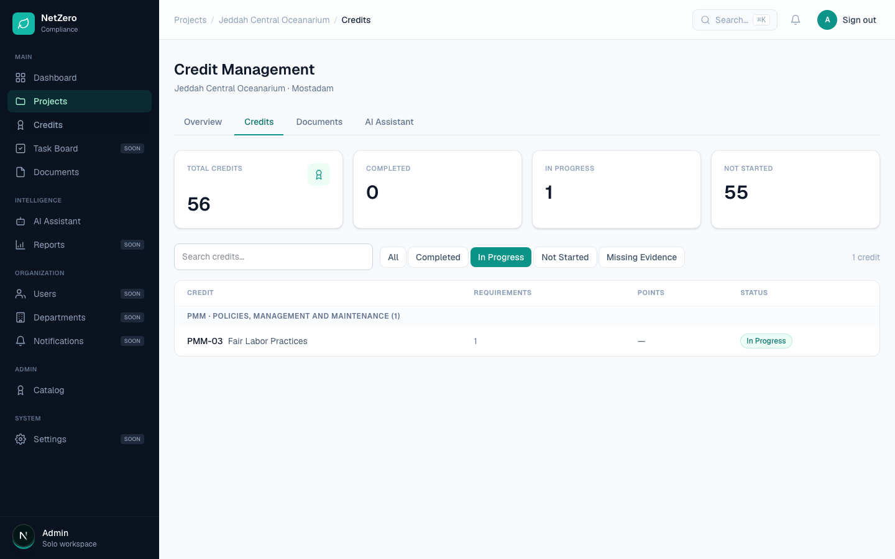

# 7 — Dashboard top cards are not clickable

**Type:** Bug · **Verdict:** Confirmed · **Effort:** XS

## As raised

> Dashboard top cards are not clickable/responsive — clicking them produces no
> action or reaction.

## What the audit found

Confirmed. The four cards are presentational only.

Scripted inspection of each card:

| Card | Wrapped in a link | Click handler | Cursor |
|---|---|---|---|
| Active Projects | no | no | default |
| Credits Completed | no | no | default |
| In Progress | no | no | default |
| Missing Evidence | no | no | default |

Clicking "Active Projects" left the URL unchanged at the dashboard.

## Root cause

The shared tile component renders a card with a label, a value and a hint. It
accepts no destination and has no interactive behaviour. The same component is
reused on the project overview and the credits list, so all three screens have
the same dead cards.

## Proposed change

Give the tile an optional destination and render it as a link when one is
supplied, with hover and focus states. Then wire the four dashboard cards:

| Card | Should open |
|---|---|
| Active Projects | the projects list |
| Credits Completed | credits filtered to Completed |
| In Progress | credits filtered to In Progress |
| Missing Evidence | credits filtered to those missing a required file |

The credits list already has working Completed / In Progress / Not Started
filters, so the first three destinations exist today. "Missing evidence" is not
currently a filter option and would need adding.

Fixing the shared component fixes the project overview and credits list at the
same time, which is why this is the cheapest item on the list.

---

## Done — 2026-09-04

The shared metric tile now takes an optional destination. Given one it renders
as a link with a pointer cursor, a hover lift and a keyboard focus ring; without
one it stays the plain card it was, so tiles that have nowhere useful to go do
not pretend otherwise.

All three screens using the component are wired: the dashboard, the project
overview and the credits list.

### The new filter

Three of the four destinations already existed as credits-list filters.
"Missing evidence" did not, so it was added: a credit matches when at least one
requirement still blocking it requires a file and has none. The rule reuses the
existing status helper, so a satisfied either/or group correctly drops its
unused alternatives instead of reporting them as gaps.

The credits list now reads `?filter=` on load and preselects that filter. An
unrecognised value falls back to "All" rather than showing an empty table.

### Where each tile goes

| Screen | Tile | Destination |
|---|---|---|
| Dashboard | Active Projects | the projects list |
| Dashboard | Credits Completed | that project's completed credits, or the projects list |
| Dashboard | In Progress | that project's in-progress credits, or the projects list |
| Dashboard | Missing Evidence | that project's credits missing a file, or the projects list |
| Project overview | all four | that project's credits, filtered |
| Credits list | all four | the same list, filtered |

The dashboard's own counts are workspace-wide, so a filtered list of one project
would misrepresent the number on the tile. With exactly one project the tile
drills straight into it; with several it opens the projects list.

### Verified

Drilling into the missing-evidence list from the project overview. The filter
arrives preselected and the count drops from 56 to 55.

| Check | Result |
|---|---|
| All four dashboard tiles are links with a pointer cursor | pass |
| Active Projects navigates to the projects list | pass |
| All four project-overview tiles are links | pass |
| Missing Evidence drills in with the filter preselected | pass, 55 of 56 |
| In Progress drills in with the filter preselected | pass, 1 of 56 |
| An unrecognised `?filter=` falls back to All | pass |

Three unit tests in `tests/nav.test.ts` cover the single-project, multi-project
and no-project cases behind the dashboard destinations.
