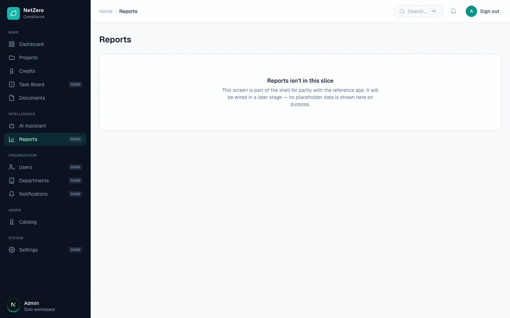
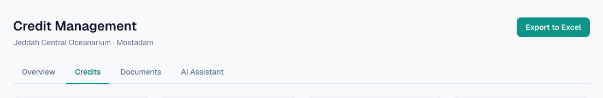
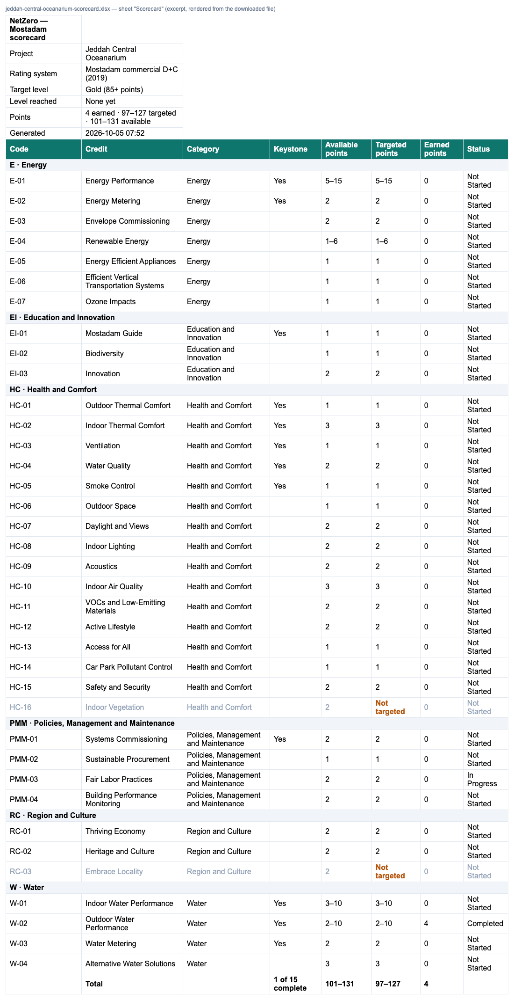

# 8 — Excel export of the scorecard

**Type:** Feature · **Verdict:** Not built · **Effort:** M

## As raised

> After uploading a scorecard or creating a new project, there should be an
> option to download an Excel export containing: all credits with total available
> points and targeted points; current status per credit; and credits that are not
> targeted, clearly labeled as such.

## What the audit found

No export control exists on any project screen. A scripted search across the
credits list, project overview and reports screen for "export", "Excel", "xlsx"
or "download" returned zero matches.

The Reports screen is an explicit placeholder.

## What already exists to build on

Most of the content the client asked for is already computed and on screen. The
credits list shows every credit with its earned and available points, its
requirement count, its category grouping and its derived status.

There is also a working precedent for generating and serving a document: the
catalog review export builds a PDF on demand and returns it as a download. The
same route shape works for a spreadsheet.

## The gap worth flagging

The request assumes a concept the product does not have: **targeted points**.
Today a project instantiates every credit in the rating-system version and there
is no way to mark a credit as targeted or not targeted. Both requested columns
("targeted points" and "credits not targeted, clearly labeled") therefore have
no data behind them.

Two ways forward:

1. **Ship the export against what exists now** — every credit, available points,
   earned points, status, category. Useful immediately, and it does not answer
   the targeting half of the request.
2. **Add credit targeting first**, then export. A per-credit "targeted" flag with
   a targeted-points figure, which also feeds the certification-level dial in
   item 11.

Recommendation: option 2, because item 11 needs the same concept. A dial showing
"progress toward target" is meaningless without a target. Doing targeting once
serves both rows.

No spreadsheet library is currently a dependency; one would need adding.

## Done — 2026-10-05 (V2 feedback)

Built on the targeting added for [row 11](../11-progress-dials/task.md), which
was option 2 above: targeting first, then the export.

### Where

An **Export to Excel** button sits in the header of the project's credits list
and of its overview. A new project lands on the credits list straight after
the wizard, so the button is there the moment a project is created.

### What the workbook contains

One sheet, "Scorecard". A downloaded sample is attached:
[sample-jeddah-central-oceanarium-scorecard.xlsx](./evidence/sample-jeddah-central-oceanarium-scorecard.xlsx).

**Header block:**

- project and rating system;
- target level;
- level reached, with the keystone rule applied;
- earned, targeted and available points;
- when it was generated.

**One row per credit**, grouped by category under a shaded heading. The
columns are Code, Credit, Category, Keystone, Available points, Targeted points,
Earned points and Status.

- **Targeted points copy the credit's available range,** as agreed. A banded
  credit reads "5–15"; a fixed one stays a plain number, so Excel can still
  work with it.
- **Credits not targeted** read **"Not targeted"** in amber, and the rest of
  the row is greyed.
- **Totals row:** available and targeted points summed as min–max ranges
  ("101–131", "97–127"), earned summed, and keystones complete ("1 of 15").

### Notes

- **The extra point.** Available and targeted totals show the catalog's sum
  (…–131), one more than the manual's 130. That is the catalog discrepancy
  recorded under row 11, and it will correct itself once the catalog is fixed.
- **No file to clean up.** The file is generated per request by
  `GET /api/projects/[id]/export` (exceljs) and nothing is written to disk.
  Signed out it returns 401; an unknown or other-workspace project returns 404.

### Checks

- **Browser** (Playwright, project "Jeddah Central Oceanarium"):
  - clicking the button downloads `jeddah-central-oceanarium-scorecard.xlsx`;
  - parsed back, it holds all 56 credits, with HC-16 and RC-03 "Not targeted",
    E-01 "5–15" and Gold as the target;
  - the totals match the overview dial;
  - the overview has the button too;
  - signed out → 401, unknown project → 404;
  - no console errors, no 5xx.
- **Unit tests:** `tests/scorecard.test.ts` builds a workbook, writes it, reads
  it back and checks:
  - the header block;
  - range and number cells;
  - the "Not targeted" label;
  - the PMM-03 fallback;
  - category grouping and the range totals.
- 121 passing with the database tests on; `tsc` clean; lint has no errors (the
  5 existing warnings are untouched).
