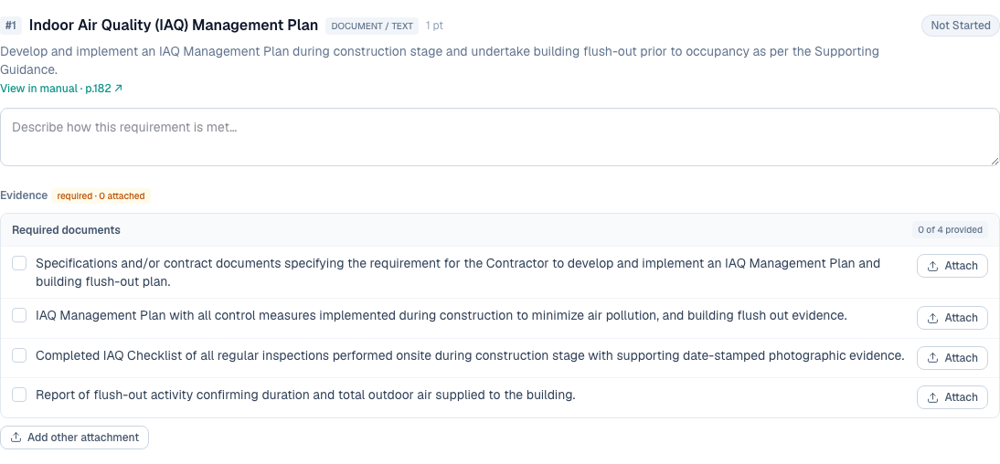
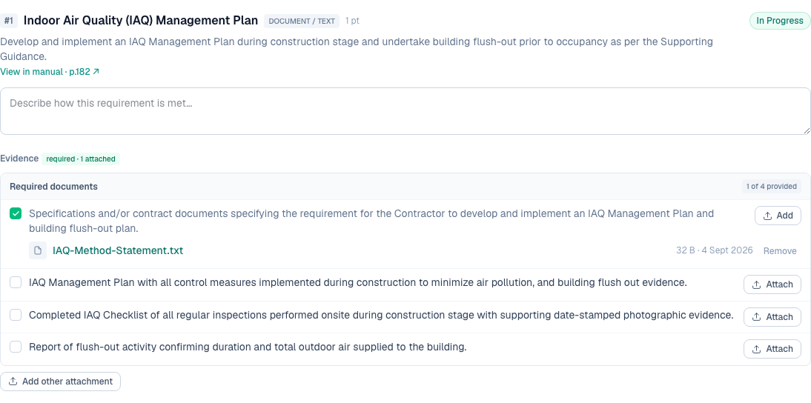

# 9 — Show a checklist of required documents per credit

**Type:** Feature · **Verdict:** Data already parsed, never rendered · **Effort:** S

## As raised

> A checklist of required documents should be shown per credit (list of required
> documents / checkbox format), so the user can see at a glance what's needed and
> what's been provided.

## What the audit found

Nothing of the sort is displayed. A credit screen shows the requirement text, an
input, and an attach button.

**The data is already in the database.** The manual parser extracts the required
evidence documents for each requirement and stores them, both as a plain list of
document descriptions and as a richer form tagged by certification stage.

| Requirements in the seeded catalog | 99 |
|---|---|
| Carrying a parsed list of required documents | 93 |
| Carrying an empty list | 6 |

A sample stored entry, from HC-10 requirement 1:

> "Specifications and/or contract documents specifying the requirement for the
> Contractor to develop and implement an IAQ Management Plan and building
> flush-out plan."
>
> "IAQ Management Plan with all control measures implemented during construction
> to minimize air pollution, and building flush out evidence."

The only thing missing is a component that renders it. This is the best
value-per-hour item on the list.

## Root cause

The field is read into the data layer and carried all the way to the requirement
view, then never used by any component.

## Proposed change

Under each requirement, render the parsed document list as a checklist. Each
row is one expected document, with a tick once a file has been attached against
it.

One decision to make: whether an attachment is linked to a specific expected
document or simply to the requirement. Linking each upload to the document it
satisfies is what makes the checkbox meaningful, and it means the upload form
needs to carry which slot is being filled. Without that link the ticks can only
reflect "something is attached to this requirement", which is weaker but far
cheaper.

Recommendation: ship the unlinked version first, since it renders data that
already exists and needs no schema change. Add per-document linking with item 14,
which raises the same modelling question.

The six requirements with an empty list are the same six that render as
"(optional)" in item 1. Fixing that item and this one together gives every
requirement either a real document list or an explicit "evidence required, list
not extracted from the manual" note.

---

## Done — 2026-09-04

Each requirement now shows the documents the manual asks for, as a checklist,
with what has been provided against each. The text is the parsed evidence table
verbatim — no new content was written.

Empty, on HC-10 requirement 1 (four required documents):

After attaching a file against the first document:

PMM-03 requirement 1, two of five provided, with an unassigned extra:

### The decision that was left open, and how it was settled

The audit flagged one question: does an attachment link to a *specific* expected
document, or just to the requirement? Without the link a tick can only mean
"something was uploaded here", which would mark every document provided the
moment one file arrived. That is a checkbox that lies, and worse than none on a
compliance screen.

So the link was built. `evidence_doc` gains one nullable column,
`evidence_spec_index`, pointing at a position in the requirement's parsed
document list. Migration `0002_overconfident_rockslide.sql`, additive only.

- Each checklist row has its own Attach control, so a file arrives already
  assigned to the document it provides.
- Files can still be attached without claiming a document. They appear under
  "Other attachments" and tick nothing.
- The column is nullable, so it can never block an upload, and every file that
  existed before this change simply reads as unassigned.
- An index pointing past the end of the list — possible if a catalog is
  re-parsed with fewer documents — degrades to unassigned rather than vanishing.

A tick therefore means that document was provided.

### Coverage

93 of the 99 requirements in the seeded Commercial D+C catalog carry a parsed
document list and get a checklist. The remaining 6 show the plain attachment
control, and are the same 6 that [row 1](../01-evidence-not-optional/task.md)
made evidence-required regardless.

### Verified

| Check | Result |
|---|---|
| The block renders with the manual's own wording | pass |
| Starts at "0 of 4 provided" on HC-10 | pass |
| Attaching against document 1 ticks only that row | pass, 1 of 4 |
| It does not tick every row | pass, exactly 1 tick |
| An unassigned file lands under "Other attachments" | pass |
| An unassigned file does not change the provided count | pass, still 1 of 4 |
| Removing the file un-ticks its row | pass, back to 0 of 4 |
| The unassigned file survives that removal | pass |
| PMM-03's five-document list behaves the same | pass, 2 of 5 |

### Follow-up left open

The "provided" count is not wired into credit scoring: a credit does not yet
require every listed document before it can complete. That is a scoring change
and belongs with [row 14](../14-per-requirement-checkbox/task.md), which raises
the same modelling question and is yours to decide.
