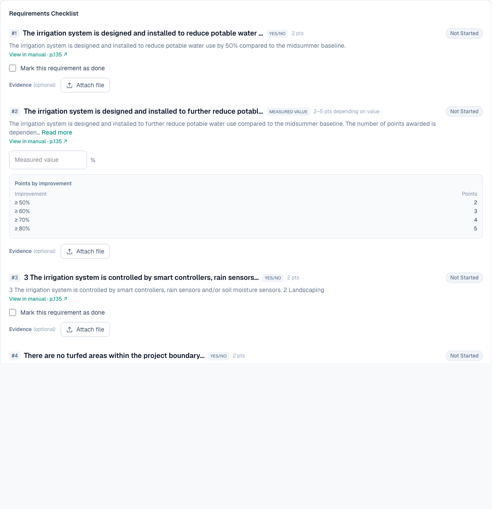
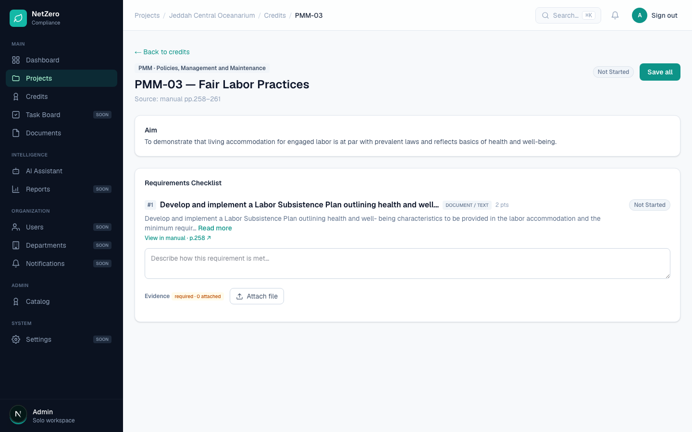

# 9 — Show a checklist of required documents per credit

**Type:** Feature · **Verdict:** Data already parsed, never rendered · **Effort:** S

## As raised

> A checklist of required documents should be shown per credit (list of required
> documents / checkbox format), so the user can see at a glance what's needed and
> what's been provided.

## What the audit found

Nothing of the sort is displayed. A credit screen shows the requirement text, an
input, and an attach button.

**The data is already in the database.** The manual parser extracts the required
evidence documents for each requirement and stores them, both as a plain list of
document descriptions and as a richer form tagged by certification stage.

| Requirements in the seeded catalog | 99 |
|---|---|
| Carrying a parsed list of required documents | 93 |
| Carrying an empty list | 6 |

A sample stored entry, from HC-10 requirement 1:

> "Specifications and/or contract documents specifying the requirement for the
> Contractor to develop and implement an IAQ Management Plan and building
> flush-out plan."
>
> "IAQ Management Plan with all control measures implemented during construction
> to minimize air pollution, and building flush out evidence."

The only thing missing is a component that renders it. This is the best
value-per-hour item on the list.

## Root cause

The field is read into the data layer and carried all the way to the requirement
view, then never used by any component.

## Proposed change

Under each requirement, render the parsed document list as a checklist. Each
row is one expected document, with a tick once a file has been attached against
it.

One decision to make: whether an attachment is linked to a specific expected
document or simply to the requirement. Linking each upload to the document it
satisfies is what makes the checkbox meaningful, and it means the upload form
needs to carry which slot is being filled. Without that link the ticks can only
reflect "something is attached to this requirement", which is weaker but far
cheaper.

Recommendation: ship the unlinked version first, since it renders data that
already exists and needs no schema change. Add per-document linking with item 14,
which raises the same modelling question.

The six requirements with an empty list are the same six that render as
"(optional)" in item 1. Fixing that item and this one together gives every
requirement either a real document list or an explicit "evidence required, list
not extracted from the manual" note.
