# 9 — Show a checklist of required documents per credit

**Type:** Feature · **Verdict:** Data already parsed, never rendered · **Effort:** S

## As raised

> A checklist of required documents should be shown per credit (list of required
> documents / checkbox format), so the user can see at a glance what's needed and
> what's been provided.

## What the audit found

Nothing of the sort is displayed. A credit screen shows the requirement text, an
input, and an attach button.

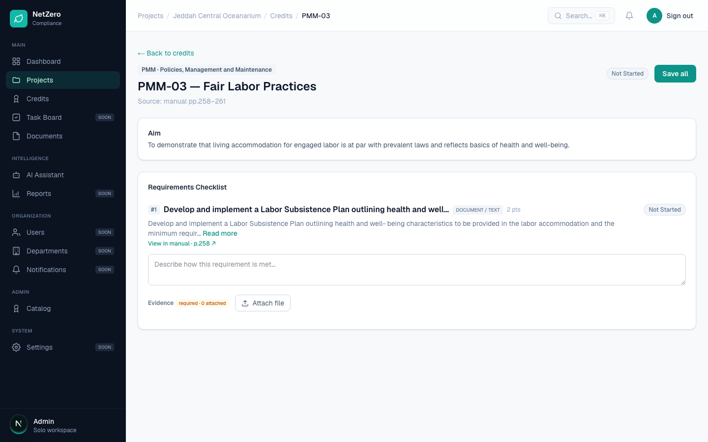

**The data is already in the database.** The manual parser extracts the required
evidence documents for each requirement and stores them, both as a plain list of
document descriptions and as a richer form tagged by certification stage.

| Requirements in the seeded catalog | 99 |
|---|---|
| Carrying a parsed list of required documents | 93 |
| Carrying an empty list | 6 |

A sample stored entry, from HC-10 requirement 1:

> "Specifications and/or contract documents specifying the requirement for the
> Contractor to develop and implement an IAQ Management Plan and building
> flush-out plan."
>
> "IAQ Management Plan with all control measures implemented during construction
> to minimize air pollution, and building flush out evidence."

The only thing missing is a component that renders it. This is the best
value-per-hour item on the list.

## Root cause

The field is read into the data layer and carried all the way to the requirement
view, then never used by any component.

## Proposed change

Under each requirement, render the parsed document list as a checklist. Each
row is one expected document, with a tick once a file has been attached against
it.

One decision to make: whether an attachment is linked to a specific expected
document or simply to the requirement. Linking each upload to the document it
satisfies is what makes the checkbox meaningful, and it means the upload form
needs to carry which slot is being filled. Without that link the ticks can only
reflect "something is attached to this requirement", which is weaker but far
cheaper.

Recommendation: ship the unlinked version first, since it renders data that
already exists and needs no schema change. Add per-document linking with item 14,
which raises the same modelling question.

The six requirements with an empty list are the same six that render as
"(optional)" in item 1. Fixing that item and this one together gives every
requirement either a real document list or an explicit "evidence required, list
not extracted from the manual" note.

---

## Done — 2026-09-04

Each requirement now shows the documents the manual asks for, as a checklist,
with what has been provided against each. The text is the parsed evidence table
verbatim — no new content was written.

Empty, on HC-10 requirement 1 (four required documents):

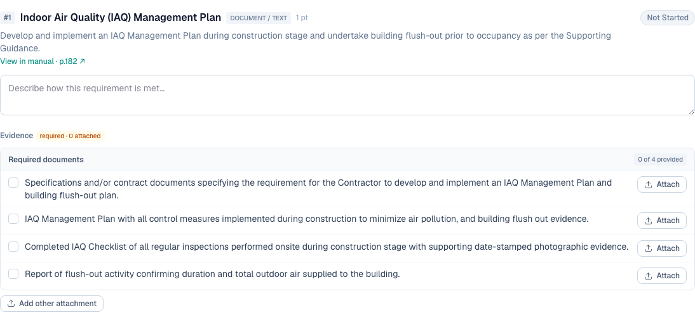

After attaching a file against the first document:

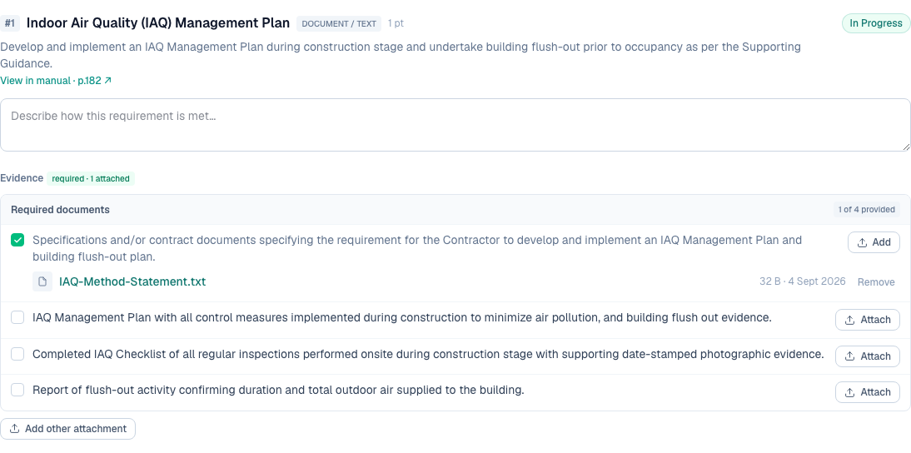

PMM-03 requirement 1, two of five provided, with an unassigned extra:

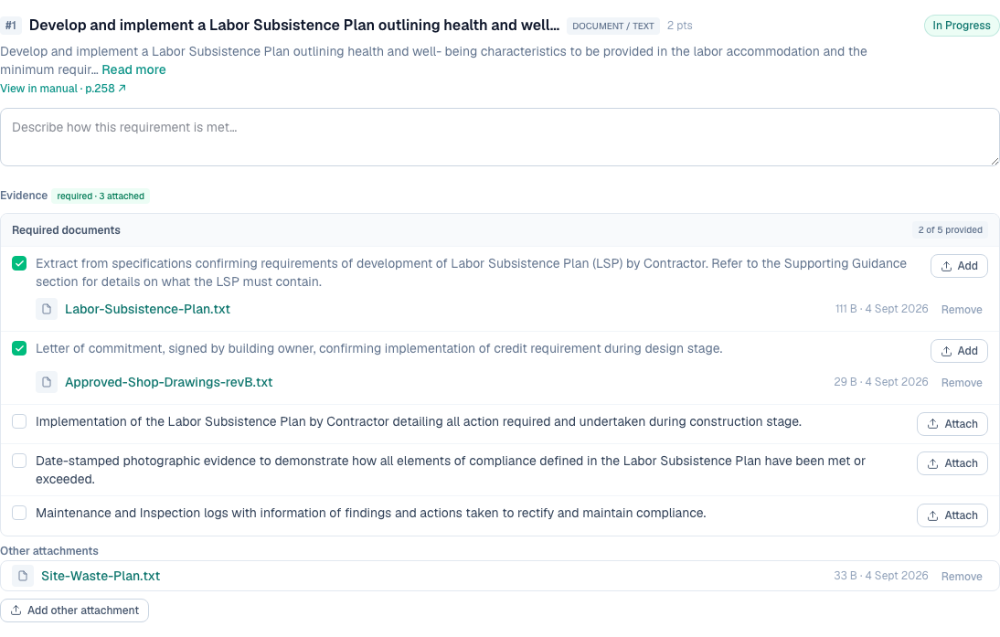

### The decision that was left open, and how it was settled

The audit flagged one question: does an attachment link to a *specific* expected
document, or just to the requirement? Without the link a tick can only mean
"something was uploaded here", which would mark every document provided the
moment one file arrived. That is a checkbox that lies, and worse than none on a
compliance screen.

So the link was built. `evidence_doc` gains one nullable column,
`evidence_spec_index`, pointing at a position in the requirement's parsed
document list. Migration `0002_overconfident_rockslide.sql`, additive only.

- Each checklist row has its own Attach control, so a file arrives already
  assigned to the document it provides.
- Files can still be attached without claiming a document. They appear under
  "Other attachments" and tick nothing.
- The column is nullable, so it can never block an upload, and every file that
  existed before this change simply reads as unassigned.
- An index pointing past the end of the list — possible if a catalog is
  re-parsed with fewer documents — degrades to unassigned rather than vanishing.

A tick therefore means that document was provided.

### Coverage

93 of the 99 requirements in the seeded Commercial D+C catalog carry a parsed
document list and get a checklist. The remaining 6 show the plain attachment
control, and are the same 6 that [row 1](../01-evidence-not-optional/task.md)
made evidence-required regardless.

### Verified

| Check | Result |
|---|---|
| The block renders with the manual's own wording | pass |
| Starts at "0 of 4 provided" on HC-10 | pass |
| Attaching against document 1 ticks only that row | pass, 1 of 4 |
| It does not tick every row | pass, exactly 1 tick |
| An unassigned file lands under "Other attachments" | pass |
| An unassigned file does not change the provided count | pass, still 1 of 4 |
| Removing the file un-ticks its row | pass, back to 0 of 4 |
| The unassigned file survives that removal | pass |
| PMM-03's five-document list behaves the same | pass, 2 of 5 |

### Follow-up left open

The "provided" count is not wired into credit scoring: a credit does not yet
require every listed document before it can complete. That is a scoring change
and belongs with [row 14](../14-per-requirement-checkbox/task.md), which raises
the same modelling question and is yours to decide.

## Done — 2026-10-05 (V2 feedback: make it prominent)

The V2 log still marked this row Pending, even though the checklist shipped in
Sprint 1. The likely reason is that it sat under each requirement, below the
value inputs and band tables, so on a long credit it was easy to miss. Hadi's
call: make it prominent.

### One box at the top of the credit

**Required documents** is now its own card, directly under the Aim and above
the Requirements Checklist. It is the first thing on the credit after the aim.

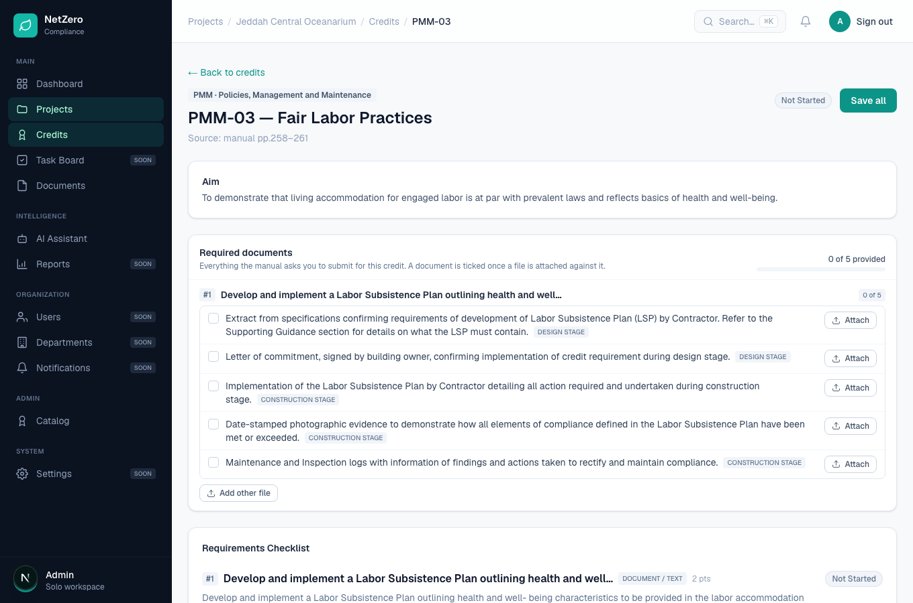

- **One overall count** with a progress bar, "1 of 5 provided", across the
  whole credit.
- **Grouped by requirement** (#1, #2 …), each group with its own count. Every
  upload still lands against exactly one requirement and one document slot, so
  nothing about how files are stored changed.
- **Stage tags.** Each document carries the stage it belongs to (DESIGN STAGE /
  CONSTRUCTION STAGE). The manual extract already held it, and it explains
  lists like E-01's, where "Prescriptive Energy Tool" appears once per stage.
- **The AI review** still sits under each attached file.

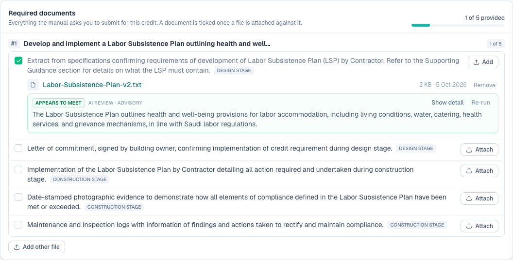

Each requirement row in the checklist now carries a compact chip ("required ·
1 of 5 documents") with a link that jumps up to its group in the box.

### How it follows row 14's planning

- **A set-aside either/or path** is left out of the box and named at the
  bottom ("Not listed: #2 Performance Option").
- **An optional row nobody has started** is listed with an "Optional · only if
  pursued" tag but not counted. Once started it reads "Optional · pursuing" and
  counts.

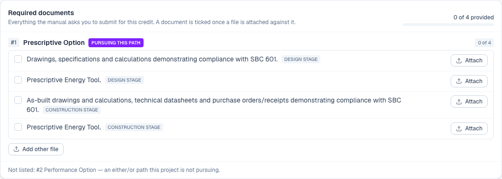

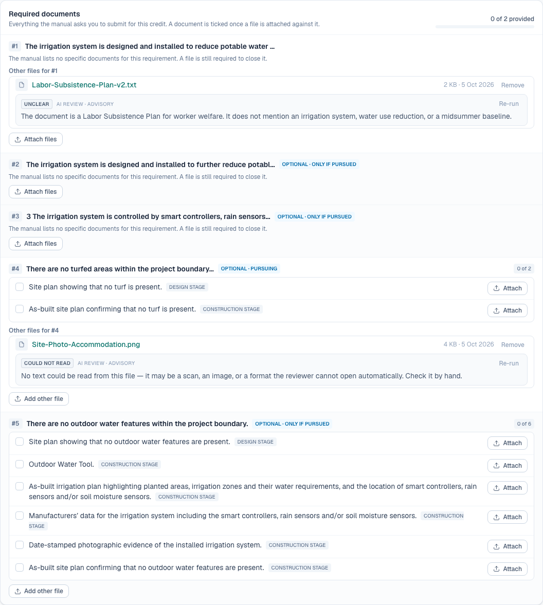

### Documents now gate completion

Added the same day, after Hadi's review. A requirement now completes only when
every listed document **due at the project's stage** has a file attached
against it.

**The project has a stage.** It is set in the wizard and changeable from the
overview's Certification progress card. Existing projects start at Design.

| Stage | Documents due | Documents listed but not due |
|---|---|---|
| Design | design-stage | construction-stage, shown dimmed as "due later, not required yet" |
| Construction | every listed document | none |

- **Untagged documents.** A document with no stage tag in the extract is always
  due.
- **Other files never count.** "Other files" and credit-level additional
  attachments never stand in for a listed document.
- **No listed documents.** Requirements whose manual entry lists no documents
  (6 of 99) keep the old rule: at least one file.
- **Listed, but none due yet.** Documents are listed but none is due at the
  current stage; MW-02 lists construction-stage documents only. At design stage
  nothing is owed. The requirement can complete on its value, and its chip
  reads "no documents due at this stage". This was fixed after code review: it
  had fallen back to the at-least-one-file rule, which forced an early upload.
- **Counts.** The box and each requirement now count only due documents
  ("0 of 1 due"). The missing-evidence filter, dashboard counts and assistant
  ("1 of 2 documents due provided") all follow the same rule.

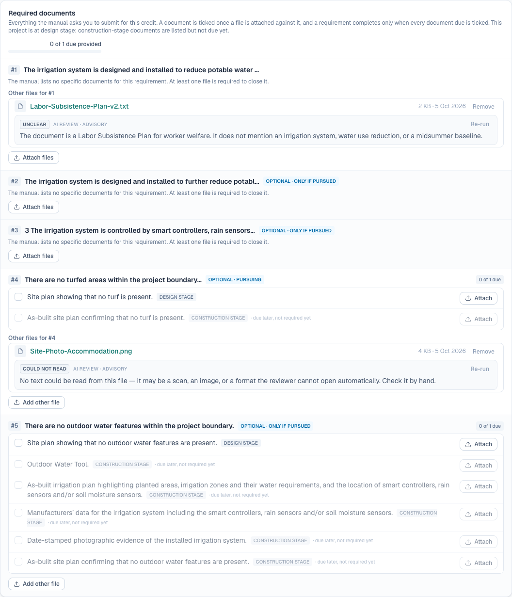

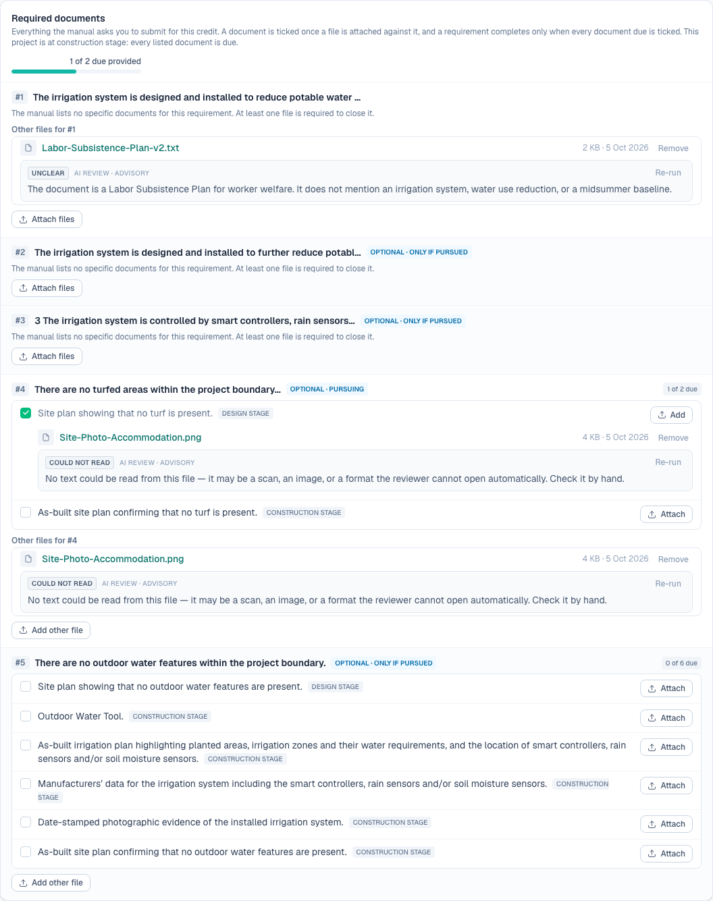

**Browser check** on W-02 in the Jeddah project:

1. W-02 had been Completed with only an "other" file on #4. It dropped to In
   Progress (0 of 1 due).
2. Attaching against #4's design-stage document completed it again.
3. Switching the project to Construction reopened it (1 of 2 due), and it
   joined the missing-evidence filter.
4. Switching back to Design completed it again.

Also checked:

- PMM-03 stays In Progress at 1 of 2 due;
- no console errors, no 5xx.

Migration `0007` adds `project.stage`.

### Checks

- **Browser** (Playwright, project "Jeddah Central Oceanarium"):
  - section order is Aim > Required documents > Requirements Checklist;
  - PMM-03 goes 0 → 1 of 5 after uploading the Labor Subsistence Plan to slot 1;
  - the AI review rendered "appears to meet";
  - the chip jumps to the box;
  - W-02 and E-01 counts are correct;
  - no console errors, no 5xx.
- **Unit tests:** `tests/evidence.test.ts` (document counting and scope) and
  `pathStates`. 98 passing.
- `tsc` clean; lint has no errors (the 5 existing warnings are untouched).

### Either/or credits: pick the path first (follow-up, 2026-10-05)

Hadi found the box hard to follow on either/or credits. It listed every option's
documents side by side, each tagged "Either/or option". Now:

- **Until a path is picked,** the group is a single "Choose the path this
  project will pursue" step, with one button per option (its points and how
  many documents it lists).
- **Once picked,** only that path's documents are listed. The other options are
  named under "Not listed".
- **The requirement rows** of an unpicked group say "Pick a path above to see
  its documents" instead of linking to a list that is not there yet.

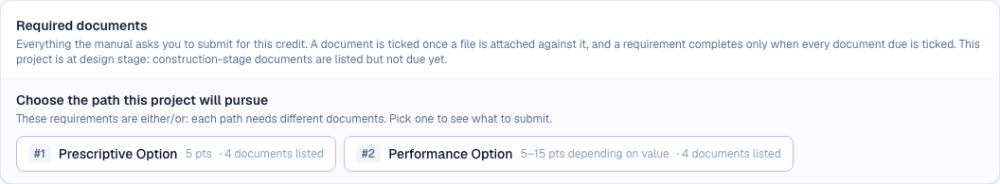

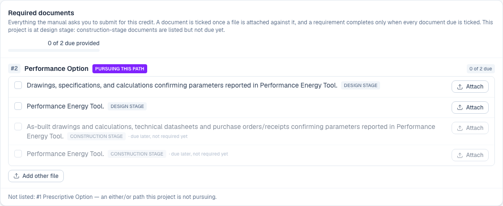
