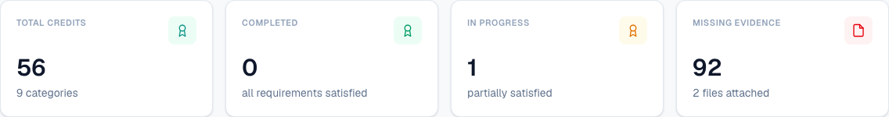
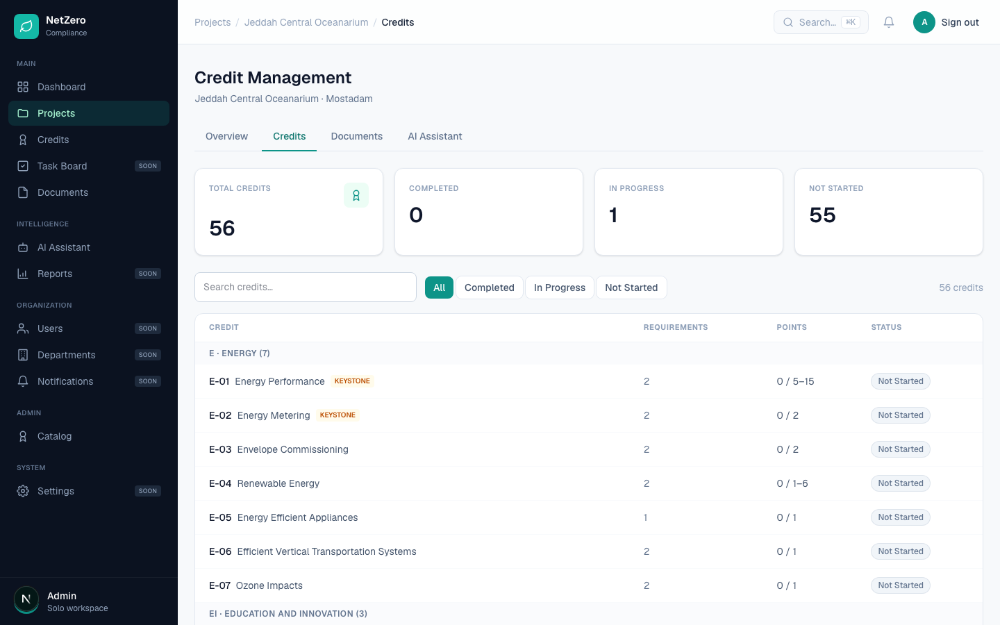

# 11 — Progress dials for project points and per-credit status

**Type:** Feature · **Verdict:** Not built · **Effort:** M

## As raised

> Add a progress dial/gauge showing current status of total points achieved: (a)
> an overall project-level dial showing total points progress toward
> target/certification level, and (b) a per-credit dial showing that individual
> credit's current status.

## What the audit found

No gauge exists. The project overview shows four flat counters.

The credits list shows a points column per credit, rendered as text.

## What already exists to build on

More than it looks. Points are already derived rather than self-reported:

- Each credit carries earned points and an available range, already displayed as
  `0 / 5–15` style text on both the list and the detail screen.
- Banded numeric requirements already compute points from a measured value, with
  a live preview as the user types.
- Certification tier thresholds are documented in the research notes:
  Green / Bronze / Silver / Gold / Diamond, at 25 / 45 / 65 / 85 / 105 out of 130
  for Commercial.

So (b), the per-credit dial, is a rendering job over numbers that already exist.

## The gap worth flagging

(a) asks for progress "toward target/certification level" and the product has no
notion of a target. A project does not record which tier it is pursuing, nor
which credits it is targeting. Without that the dial can only show earned points
against the theoretical maximum of every credit in the manual, which is not a
number anyone pursues and would read as permanently near zero.

This is the same missing concept as item 8.

## Proposed change

1. Add a target to the project: the tier being pursued, and which credits are
   being targeted. This unblocks item 8 as well.
2. Per-credit dial: earned against the credit's available points, on the credit
   detail screen and optionally in the list.
3. Project dial: earned points against the threshold for the targeted tier, with
   the tier bands marked so the user can see which certification level the
   current total reaches.

The tier thresholds vary by scheme, stage and scope, so they belong in the
catalog next to the rating-system version rather than hardcoded in a component.
