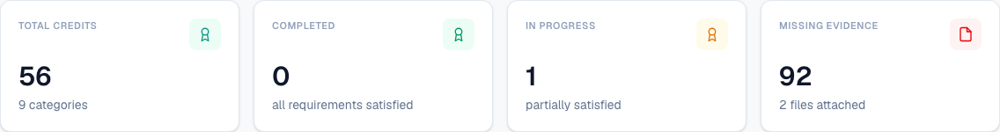
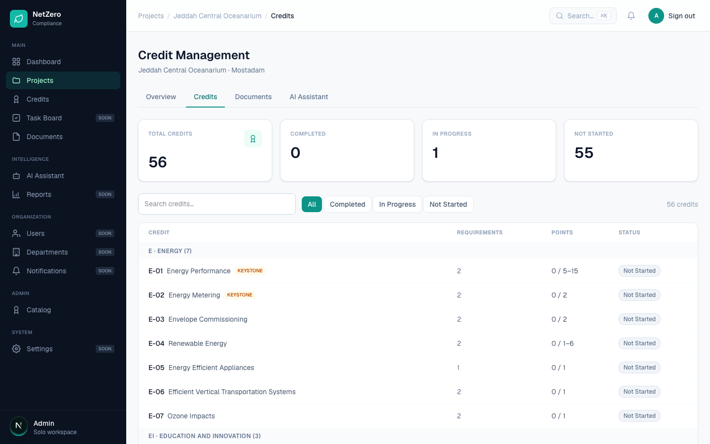
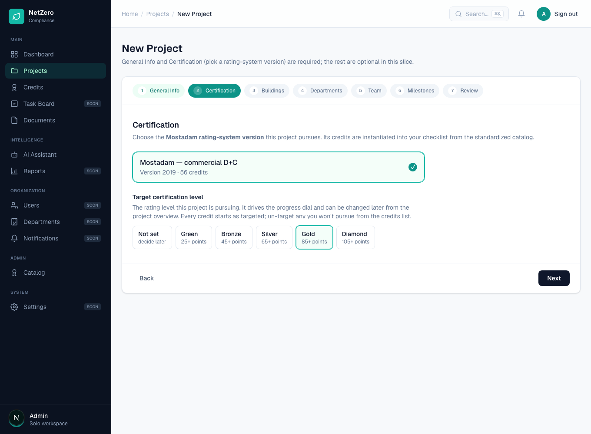
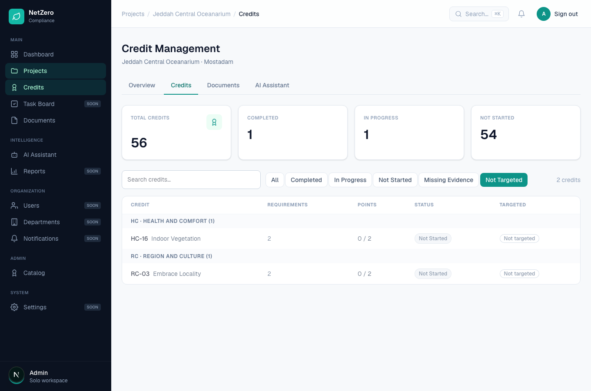
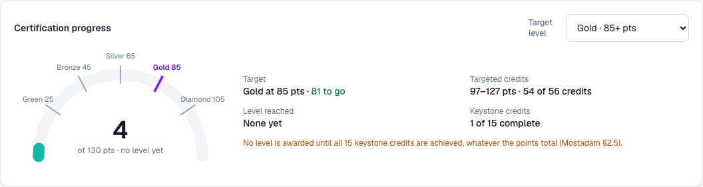
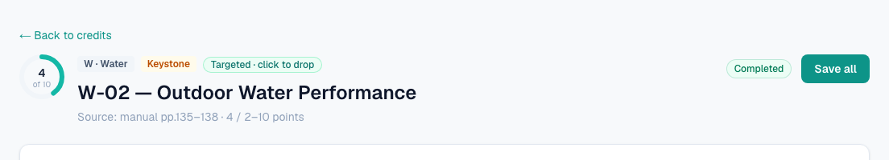
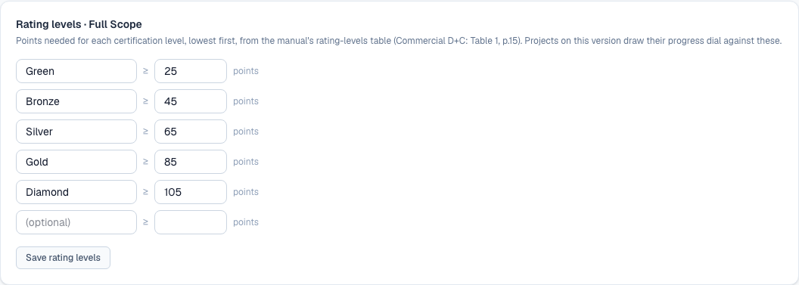

# 11 — Progress dials for project points and per-credit status

**Type:** Feature · **Verdict:** Not built · **Effort:** M

## As raised

> Add a progress dial/gauge showing current status of total points achieved: (a)
> an overall project-level dial showing total points progress toward
> target/certification level, and (b) a per-credit dial showing that individual
> credit's current status.

## What the audit found

No gauge exists. The project overview shows four flat counters.

The credits list shows a points column per credit, rendered as text.

## What already exists to build on

More than it looks. Points are already derived rather than self-reported:

- Each credit carries earned points and an available range, already displayed as
  `0 / 5–15` style text on both the list and the detail screen.
- Banded numeric requirements already compute points from a measured value, with
  a live preview as the user types.
- Certification tier thresholds are documented in the research notes:
  Green / Bronze / Silver / Gold / Diamond, at 25 / 45 / 65 / 85 / 105 out of 130
  for Commercial.

So (b), the per-credit dial, is a rendering job over numbers that already exist.

## The gap worth flagging

(a) asks for progress "toward target/certification level" and the product has no
notion of a target. A project does not record which tier it is pursuing, nor
which credits it is targeting. Without that the dial can only show earned points
against the theoretical maximum of every credit in the manual, which is not a
number anyone pursues and would read as permanently near zero.

This is the same missing concept as item 8.

## Proposed change

1. Add a target to the project: the tier being pursued, and which credits are
   being targeted. This unblocks item 8 as well.
2. Per-credit dial: earned against the credit's available points, on the credit
   detail screen and optionally in the list.
3. Project dial: earned points against the threshold for the targeted tier, with
   the tier bands marked so the user can see which certification level the
   current total reaches.

The tier thresholds vary by scheme, stage and scope, so they belong in the
catalog next to the rating-system version rather than hardcoded in a component.

## Done — 2026-10-05 (V2 feedback)

The blocker was that the product had no idea of a target. Hadi chose to add
both halves:

- **a target level per project**, set in the wizard and changeable later;
- **a targeted flag per credit**, with every credit starting targeted.

### Targeting

**Wizard.** The Certification step now asks for the target level. The options
come from the chosen version's rating levels; "Not set" is allowed.

**Overview.** A "Target level" selector changes it at any time and saves on
change.

**Credits list.** A new **Targeted** column switches each credit on or off, and
a **Not Targeted** filter lists the ones set aside. A not-targeted credit
still counts what it earns, but drops out of the targeted points. The same
switch sits in the credit page header.

**Existing projects** get every credit targeted and no target level until one
is picked. On the Jeddah test project, setting Gold took one change.

### (a) The project dial

The overview has a **Certification progress** card:

- **A half-circle gauge** of earned points against the manual's Full Scope
  total (130), with a tick per rating level. The target level's tick is
  emphasised.
- **Target:** "Gold at 85 pts · 81 to go".
- **Targeted credits:** the summed range, "97–127 pts · 54 of 56 credits" after
  two credits were un-targeted.
- **Level reached,** with the keystone rule applied. Mostadam §2.5 awards no
  level until every keystone credit is achieved, whatever the points total.
  The card says so while keystones are open (1 of 15 here). If the points alone
  would reach a level, it reads "None yet (points reach Silver)".

### (b) The per-credit dial

A ring in each credit's header shows earned against available points (W-02:
4 of 10).

For a credit with no Total in the catalog (PMM-03, HC-13, HC-15), the
maximum falls back to its requirement points. The credits list now uses the
same figure, so PMM-03 reads "0 / 2" instead of "—".

### Rating levels live in the catalog

The thresholds are stored on the rating-system version
(`rs_version.tier_thresholds`), not in a component.

- **Seeded from the manual.** Migration `0006` seeds Commercial D+C from the
  manual's Table 1 (p.15: Green ≥ 25, Bronze ≥ 45, Silver ≥ 65, Gold ≥ 85,
  Diamond ≥ 105). These were checked against the PDF, not copied from the
  research notes.
- **Editable in catalog admin.** The version page has an editor; minimums must
  be whole numbers that strictly increase.
- **Full Scope only, as agreed.** Shell Only and Fit-Out use different numbers
  (manual Table 2) and are not modelled yet.

### Why the points read 131, not 130

The catalog is correct; the gap comes from how the points are added up.

- **Points depend on the building type.** The manual's applicability table
  (Table 2) assigns each credit's points per building type. HC-07 Daylight is
  worth 2 for offices but 3 for healthcare; HC-13 Access for All is worth
  nothing for warehouses.
- **The catalog already holds that table.** The parser stored it for every
  credit in `catalog_credit.applicability`.
- **Every building type sums to exactly 130.** At Full Scope this holds for
  educational institutions, offices, retail, warehouses, hospitality, mosques
  and healthcare.
- **The 131 is the reference totals added up.** The "Total" on each credit's
  page is one reference allocation, and those totals sum to 131. Every
  credit's Total was checked against the PDF and matches.

The dial and the export add up those reference totals because a project does
not record which of the seven building types it is. The wizard's "Type" is free
text. The dial scales to the manual's 130, but the targeted and available spans
show the 131.

The proper fix is a building-type choice on the project. Points and
applicability would then come from its column, and inapplicable credits would
drop out (9 do for warehouses). That is not built yet.

### Checks

- **Browser** (Playwright):
  - wizard → Gold saved on a new project ("Riyadh Marina Tower");
  - overview selector sets Gold on Jeddah;
  - un-targeting HC-16 and RC-03 moves the targeted span 101–131 → 97–127;
  - the filter lists exactly those two;
  - W-02 ring reads 4 of 10;
  - the admin editor round-trips;
  - no console errors, no 5xx.
- **Unit tests:** `tests/tiers.test.ts` covers
  - threshold parsing;
  - 84 → Silver, 85 → Gold;
  - the keystone gate;
  - credit spans, including the PMM-03 fallback;
  - project sums.
- 117 passing with the database tests on; `tsc` clean; lint has no errors (the
  5 existing warnings are untouched).
