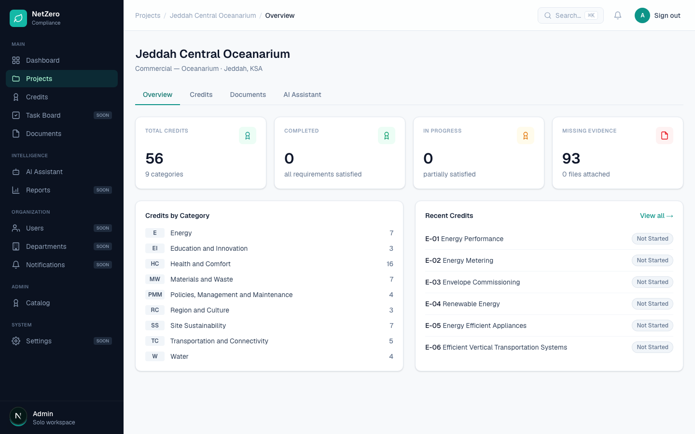
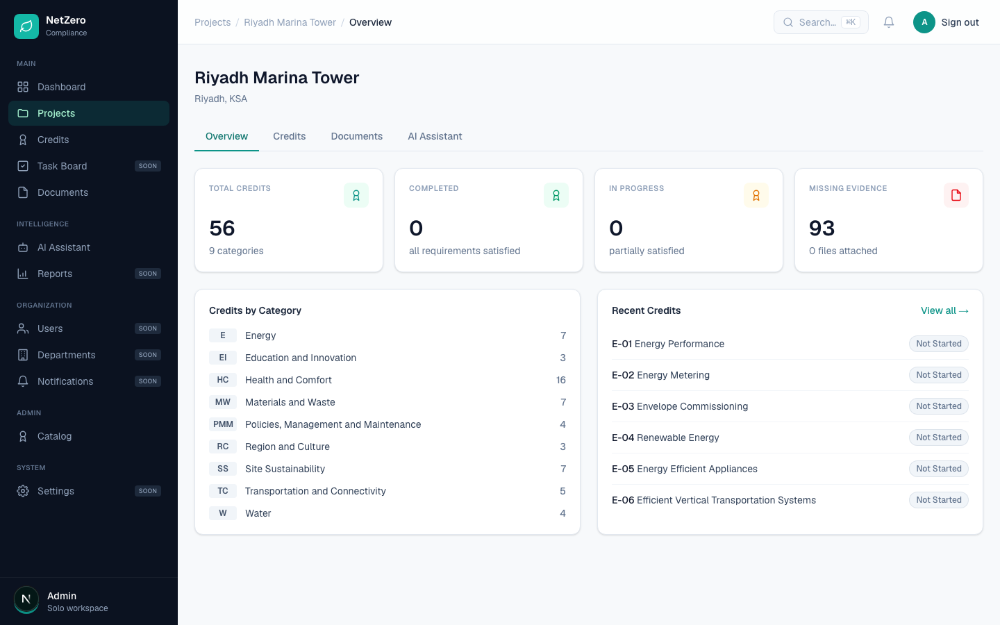
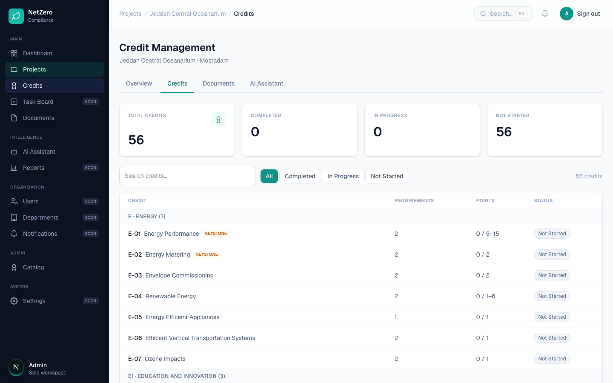
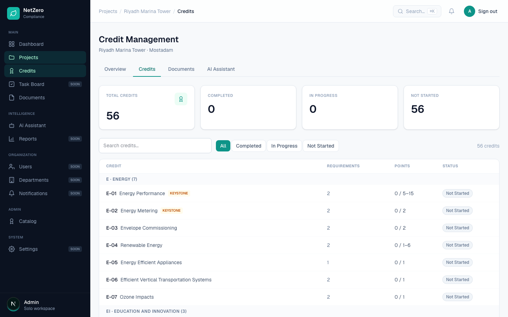

# 12 — The Credit tab under the project does not open that project's credits

**Type:** Bug · **Verdict:** Reproduced, with a different cause than reported · **Effort:** XS

## As raised

> The Credit tab under the project is not working — clicking it should navigate
> to/open the relevant project's credit view, but currently does not.

## What the audit found

The in-page Credits tab on a project works correctly. Clicked repeatedly, it
navigated in about 100 to 180 milliseconds and rendered the right project's
credits every time.

**The sidebar "Credits" entry is broken, and it is broken in a way that matches
the report.** With two projects in the workspace, the audit opened the second
project, "Riyadh Marina Tower":

Then clicked "Credits" in the left sidebar. It opened the credits of the *first*
project, "Jeddah Central Oceanarium":

| | |
|---|---|
| Expected | credits of Riyadh Marina Tower |
| Actual | credits of Jeddah Central Oceanarium |

The sidebar "Documents" entry has the same defect, confirmed in the same run.

## Root cause

The top-level Credits and Documents entries are project-scoped screens reached
from a workspace-level nav. They resolve by looking up the first project in the
workspace and redirecting to it. There is no notion of the project currently
being viewed, so from inside any project other than the first one, both entries
navigate away to the wrong project.

The reporter's project is not the first project in their workspace, which is why
the tab looked dead to them: it appeared to do nothing relevant, since it left
their project entirely.

## Proposed change

Make both entries resolve to the project currently in context, falling back to
the first project only when there is no project in context. The project id is
already in the URL on every project screen.

Worth considering as a follow-up: these two entries duplicate tabs that already
exist inside a project. Hiding them from the workspace nav while a project is
open, or scoping the whole sidebar to the active project, would remove the class
of bug rather than this one instance.

---

## Done — 2026-09-04

Project-scoped sidebar entries now follow the project that is open. `lib/nav.ts`
holds the resolution: while the URL names a project, Credits, Documents and AI
Assistant address that project directly instead of falling through to the
workspace resolver. With no project open they keep their old behaviour and
resolve to the first project, which is correct from the dashboard.

The AI Assistant entry had the same defect and is fixed with the same change,
though it was not in the original report.

### Verified

Driven in a real browser from inside the *second* project, "Riyadh Marina Tower".

| Check | Result |
|---|---|
| Sidebar Credits from project 2 | opens project 2's credits |
| Sidebar Documents from project 2 | opens project 2's documents |
| Sidebar AI Assistant from project 2 | opens project 2's assistant |
| Sidebar Credits from the dashboard | still falls back to the first project |

The heading reads "Riyadh Marina Tower · Mostadam". Before the fix the same click
produced "Jeddah Central Oceanarium · Mostadam", captured in
[`credits-opens-wrong-project.png`](./evidence/credits-opens-wrong-project.png).

The fallback path, unchanged:

Six unit tests in `tests/nav.test.ts` cover project URLs, the create wizard
(`/projects/new` is not a project), the no-project fallback, and workspace-level
entries staying put.

### Follow-up left open

The README of this sprint notes that these entries duplicate tabs that already
exist inside a project. Hiding them from the workspace nav while a project is
open would remove the class of bug rather than this instance. Not done here.
