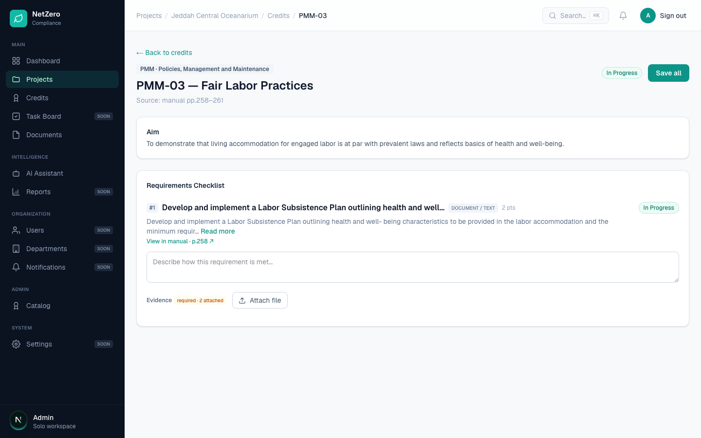
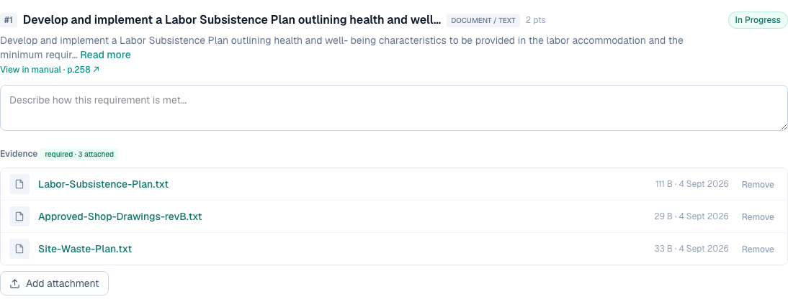

# 13 — Upload additional documents on an ongoing credit

**Type:** Feature · **Verdict:** Already works, invisible to the user · **Effort:** none beyond item 2

## As raised

> Ability to upload additional/more documents on an ongoing credit.

## What the audit found

This already works. PMM-03 was taken to "In Progress" by a first upload, then a
second, differently named file was attached to the same requirement. It was
accepted, stored and counted.

The counter went `0 attached` to `1 attached` to `2 attached` across the two
uploads, and both files are present in the project's Evidence Library.

## Root cause

The same one behind items 2, 3, 4, 5 and 10. Because the credit screen never
lists what is attached, a user cannot tell that a second upload was accepted, or
whether it replaced the first. There is no functional limit to remove.

## Proposed change

None specific to this row. It closes when the attachment list from item 2 ships,
with the add control staying visible under the list at every credit status.

Kept as its own folder so the client's numbering stays intact.

---

## Done — 2026-09-04

Already functional; now visible. The add control sits under the attachment list
and stays available at every credit status, and each upload is confirmed by the
filename appearing in the list rather than by a number changing.

After the first upload on an in-progress credit:

After adding two more:

### Verified

| Check | Result |
|---|---|
| A second and third file attach to an in-progress credit | pass |
| Earlier files are not replaced | pass, all three listed |
| Add control stays visible with files present | pass |
| Badge follows the count | pass, 1 → 3 |
