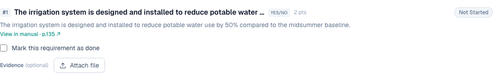

# 14 — A checkbox per sub-requirement, not one status for the whole credit

**Type:** Feature · **Verdict:** Partly built · **Effort:** M

## As raised

> For credits with multiple requirements (e.g. two or three sub-requirements),
> there should be a checkbox per requirement indicating which specific
> requirement(s) are being met and which are not, rather than only a single status
> for the whole credit.

## What the audit found

The underlying model is already per requirement, which is better than the report
assumes. Credit W-02 has five sub-requirements, each with its own row, its own
points and its own status pill:

The credit's own status is derived from those rows, not entered by hand. It only
reads "Completed" when every requirement is satisfied.

The gap is that only one of the three requirement kinds gets a checkbox.

| Requirement kind | Control offered | Explicit met / not met |
|---|---|---|
| Yes/No | a checkbox | yes |
| Measured value | a number field | no |
| Document / text | a free-text box | no |

A Yes/No requirement, showing the checkbox the client wants:

A document requirement on PMM-03, which offers only prose:

## Root cause

Status for the non-boolean kinds is inferred: a measured requirement counts as
satisfied once a number is present, a document requirement once text is written
and a file attached. There is no way for the user to state directly that a
requirement is met, or to record that it deliberately is not being pursued.

Credits also carry either/or requirement groups, where satisfying one option
completes the group and the alternatives no longer block the credit. Any explicit
met/not-met control has to respect that, or users will tick options that are not
supposed to apply.

## Proposed change

Add an explicit per-requirement state alongside the value, covering met, not met,
and not applicable, and show it for every requirement kind rather than only
Yes/No.

Decisions to settle first:

- **Does the explicit state override the derived one, or only annotate it?**
  Letting a user tick "met" with no value and no evidence would undo the
  derived-status principle the product is built on. Recommendation: the tick
  confirms a requirement whose value and evidence are already present, and
  "not met" is the state that can be set freely.
- **What "not applicable" means for scoring.** It has to exclude the requirement
  from the credit total rather than count it as zero, or a project is penalised
  for requirements that never applied to it.

Closely related to item 9. If each expected document becomes a checklist row,
the natural grain for a tick is the document rather than the requirement. Worth
designing the two together.
