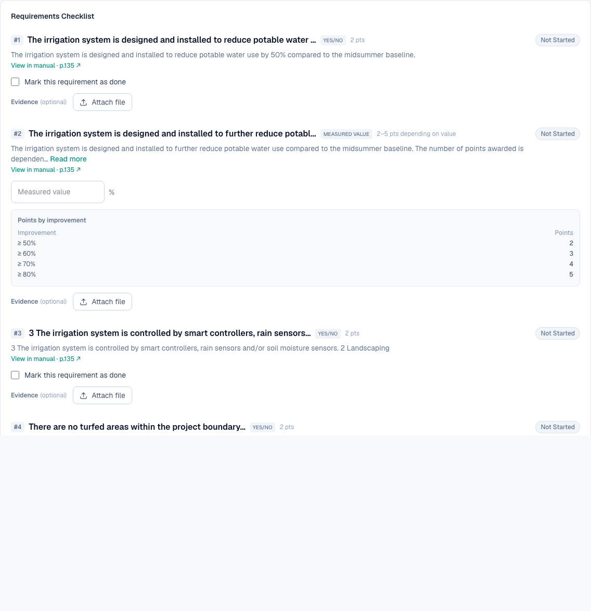
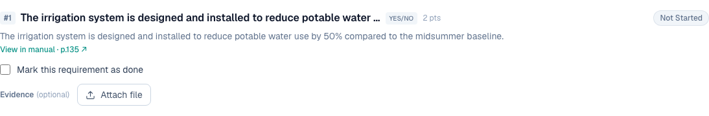
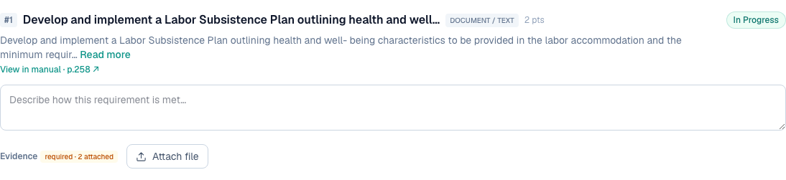
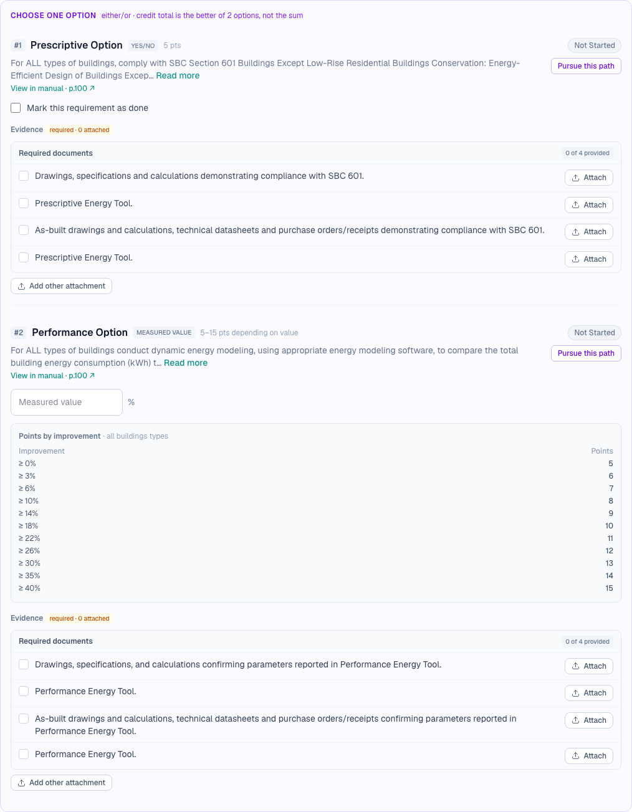
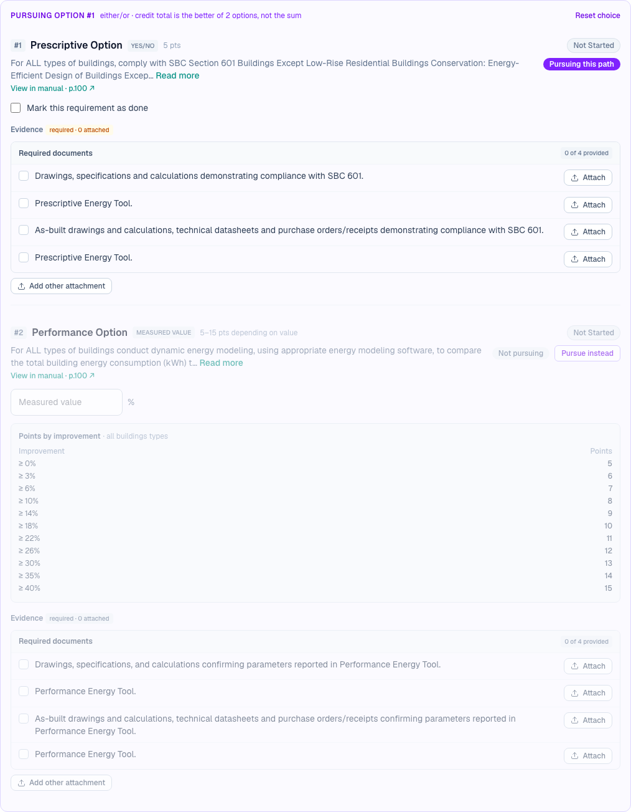
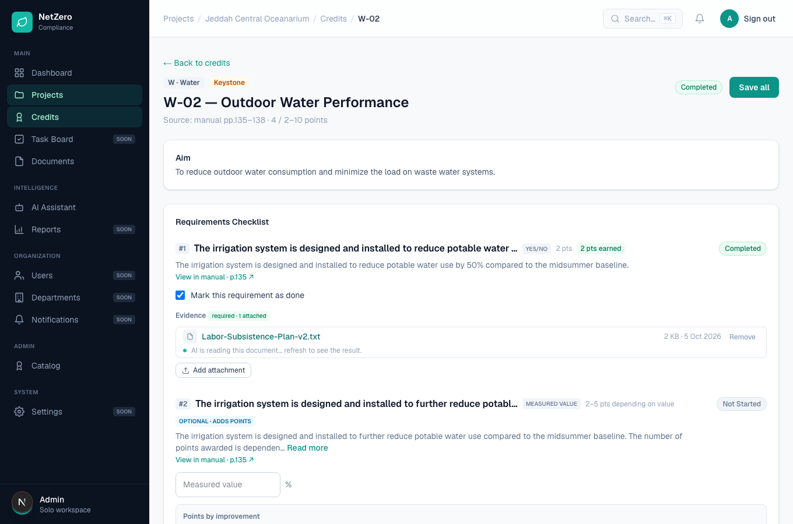
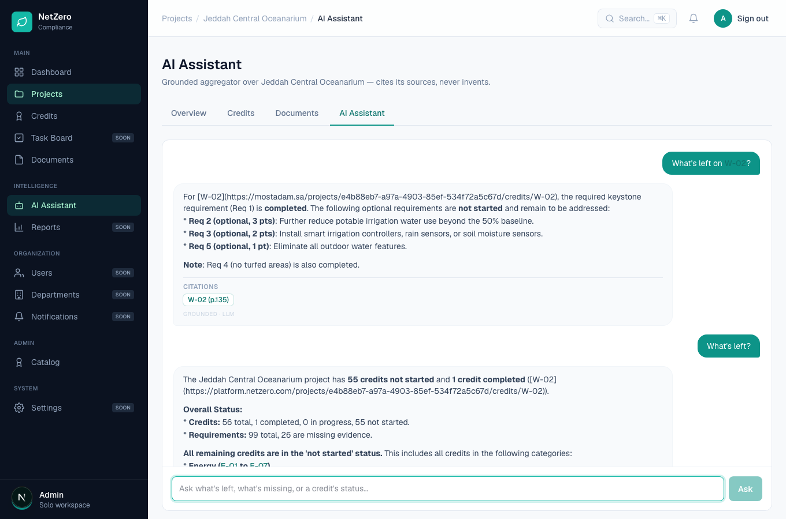
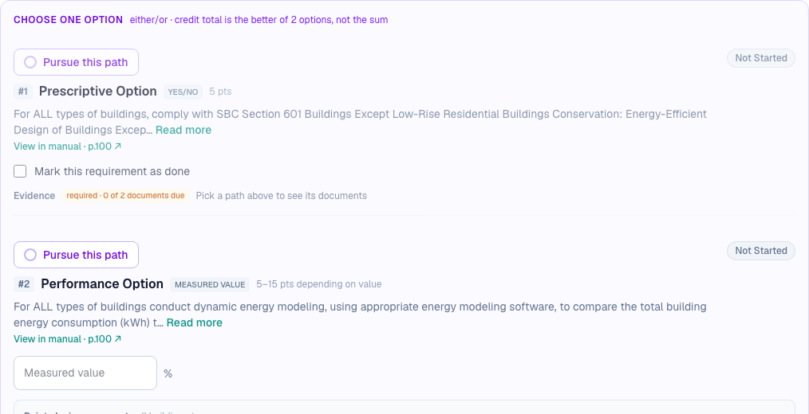
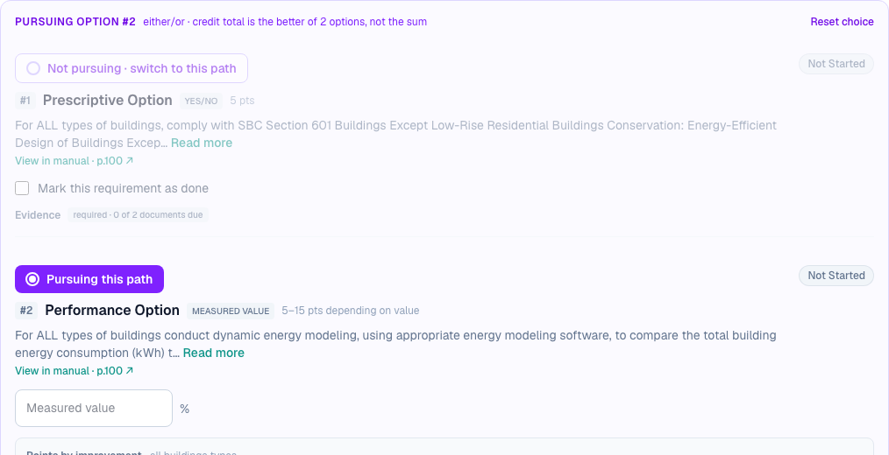

# 14 — A checkbox per sub-requirement, not one status for the whole credit

**Type:** Feature · **Verdict:** Partly built · **Effort:** M

## As raised

> For credits with multiple requirements (e.g. two or three sub-requirements),
> there should be a checkbox per requirement indicating which specific
> requirement(s) are being met and which are not, rather than only a single status
> for the whole credit.

## What the audit found

The underlying model is already per requirement, which is better than the report
assumes. Credit W-02 has five sub-requirements, each with its own row, its own
points and its own status pill:

The credit's own status is derived from those rows, not entered by hand. It only
reads "Completed" when every requirement is satisfied.

The gap is that only one of the three requirement kinds gets a checkbox.

| Requirement kind | Control offered | Explicit met / not met |
|---|---|---|
| Yes/No | a checkbox | yes |
| Measured value | a number field | no |
| Document / text | a free-text box | no |

A Yes/No requirement, showing the checkbox the client wants:

A document requirement on PMM-03, which offers only prose:

## Root cause

Status for the non-boolean kinds is inferred: a measured requirement counts as
satisfied once a number is present, a document requirement once text is written
and a file attached. There is no way for the user to state directly that a
requirement is met, or to record that it deliberately is not being pursued.

Credits also carry either/or requirement groups, where satisfying one option
completes the group and the alternatives no longer block the credit. Any explicit
met/not-met control has to respect that, or users will tick options that are not
supposed to apply.

## Proposed change

Add an explicit per-requirement state alongside the value, covering met, not met,
and not applicable, and show it for every requirement kind rather than only
Yes/No.

Decisions to settle first:

- **Does the explicit state override the derived one, or only annotate it?**
  Letting a user tick "met" with no value and no evidence would undo the
  derived-status principle the product is built on. Recommendation: the tick
  confirms a requirement whose value and evidence are already present, and
  "not met" is the state that can be set freely.
- **What "not applicable" means for scoring.** It has to exclude the requirement
  from the credit total rather than count it as zero, or a project is penalised
  for requirements that never applied to it.

Closely related to item 9. If each expected document becomes a checklist row,
the natural grain for a tick is the document rather than the requirement. Worth
designing the two together.

## Done — 2026-10-05 (V2 feedback)

### What the client meant

The V2 log kept this row Pending. Talking it through, the ask is not "tick which
requirements are met". It is **"mark which path we are pursuing"**: when a credit
offers either/or options, picking one fades the others, so anyone opening the
credit sees at a glance which path the project is planning against.

Rows outside an either/or group get no control. The credit's derived status, and
the derived-status model, are unchanged.

### Choosing a path

Every option in an either/or group (E-01 Prescriptive vs Performance) now has a
**Pursue this path** button.

Picking one does four things:

- marks the choice in the group header ("Pursuing option #1");
- fades the alternative, whose control reads "Not pursuing · switch to this
  path";
- takes the alternative out of the credit's status, its points, the "missing
  evidence" filter and the assistant's answers;
- adds a "Reset choice" button that brings every option back.

The buttons post through the credit's Save form, so values already typed on the
page are saved, not lost. With no path chosen, the group behaves exactly as
before: any finished option satisfies it.

The choice is stored per requirement as `requirement_entry.planned` (migration
`0004`). Every existing row defaults to planned, so nothing changes for projects
already in flight.

### Optional rows never block

Talking this row through also turned up a scoring bug. A row that adds points
but is not required, such as W-02 #2–#5, still blocked its credit from reaching
Completed. Hadi ruled that optional rows must never block.

A row counts as **optional** when all four hold:

- it sits outside an either/or group;
- it is not a keystone requirement;
- it carries points of its own;
- another row in the same credit also earns points.

Rows with no points are prerequisites ("In addition to #1…") and stay mandatory.
A credit's only point-earning row is the credit itself (PMM-03), so it stays
mandatory too. That last condition was added the same day, when building row 9
showed PMM-03 wrongly badged optional.

| Row state | Effect on the credit |
|---|---|
| Optional, not started | Does not block. Shown with an **Optional · adds points** badge; its evidence chip reads "required if pursued". |
| Optional, started | Must be finished, just like a mandatory row. |
| Only optional rows in the credit | Completed once one is finished and none is left half-done. |

### The assistant

Untouched optional rows stay in the assistant's "what's left", but in their own
**Optional — adds points** block with their points, never mixed in with what
blocks the credit. The LLM prompt says the same, and also tells it never to list
a set-aside path as remaining.

### Checks

- **Browser** (Playwright, fresh project "Jeddah Central Oceanarium"):
  - E-01: choose, reset and switch paths;
  - W-02: #1 and #4 finished with files attached, the rest untouched, credit reaches Completed;
  - W-02 is absent from the missing-evidence filter, while E-01's chosen path is listed there;
  - the assistant labels W-02's optional rows;
  - no console errors, no 5xx.
- **Unit tests:** 18 new across status, points and assistant. 88 passing.
- `tsc` clean; lint has no errors (the 5 existing warnings are untouched).

### Found along the way, not changed here

- **Missed groups.** E-01 is the only either/or group in the current catalog.
  EI-03 and TC-01 each show a lone "Option 1", which suggests the parser missed
  their groups. Worth a catalog review.
- **Made-up link domains.** In LLM mode the assistant sometimes writes absolute
  links on made-up domains (`https://mostadam.sa/projects/…`), although the facts
  only carry relative paths. This was already happening; it is a separate fix.

### Follow-up (2026-10-05): the control moved to the left

Hadi found "Pursue this path" hard to spot in the right-hand column under the
status pill. It is now a radio-style control on the first line of each option,
on the left:

- **Not picked:** an empty circle with "Pursue this path".
- **Chosen:** a filled violet "Pursuing this path".
- **Set aside:** "Not pursuing · switch to this path".

