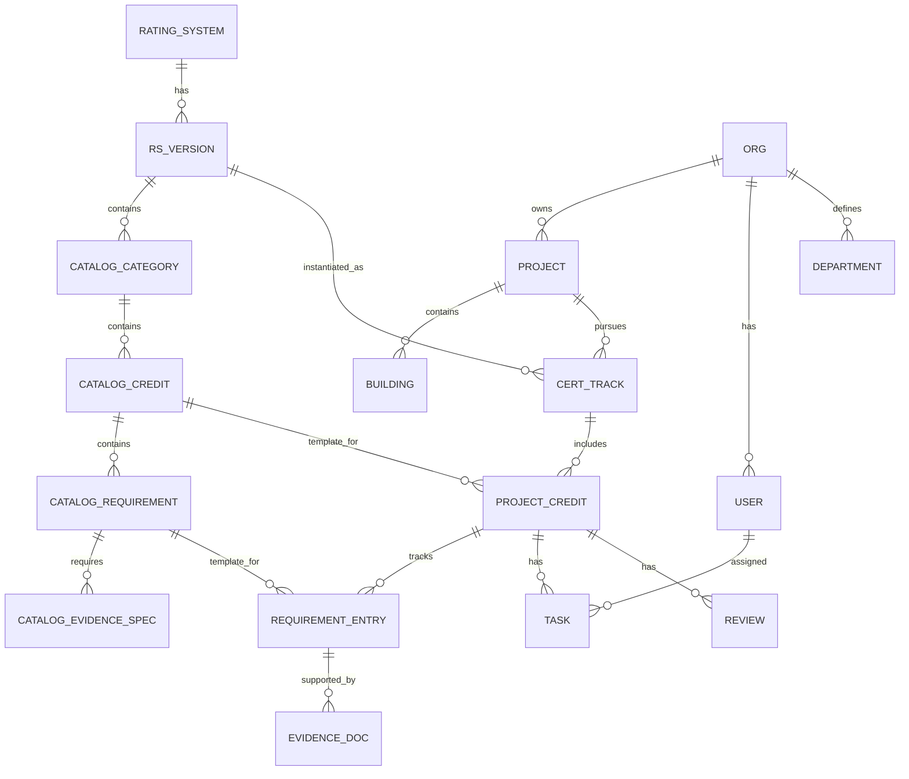

# Data Model (proposed)

> Derived directly from the Mostadam manual structure ([`../research/domain/mostadam-credit-anatomy.md`](../research/domain/mostadam-credit-anatomy.md)) and the reference-app teardown ([`../research/reference-site/sustainiq-ui-analysis.md`](../research/reference-site/sustainiq-ui-analysis.md)). This is a first architecture draft to align on before building — not final schema.

## The single most important idea: **Catalog (template) vs Project (instance)**

There are two layers, and keeping them separate is the whole ballgame:

1. **Catalog layer (template, shared, versioned):** the rating systems and their credits/requirements as published in the manuals. Authored/curated once (and later assisted by document parsing). Immutable per version.
2. **Instance layer (per project):** a project selects a rating system → the catalog is **copied/linked** into the project as trackable items that carry *this project's* values, evidence, owners, statuses.

---

## Catalog layer

### `rating_system`
`id`, `key` (e.g. `mostadam`), `name`, `country`, `authority`.

### `rs_version`  (a scheme + lifecycle stage + scope is a distinct addressable config)
Because **codes are only unique within (scheme, stage)** and **tiers vary by (scheme, stage, scope)**, model the addressable unit explicitly:
`id`, `rating_system_id`, `scheme` (`residential` | `communities` | `commercial`), `stage` (`D+C` | `O+E`), `scope` (`shell` | `core_and_shell` | `fit_out` | `full` | n/a), `version_label` (e.g. `2019`), `total_points`, `tier_thresholds` (JSON: `[{tier:'Green',min:25}, … {tier:'Diamond',min:105}]`).

### `catalog_category`
`id`, `rs_version_id`, `code` (`E`,`W`,`HC`,`SS`,`TC`,`PMM`,`MW`,`RC`,`EI`), `name`, `sort_order`.

### `catalog_credit`
`id`, `rs_version_id`, `category_id`, `code` (e.g. `HC-10`), `title`, `is_keystone` (mandatory), `max_points`, `intent`, `tool_ref` (nullable, e.g. "Energy Tool"), `references` (string[]). **Uniqueness key: (`rs_version_id`, `code`).**

### `catalog_requirement`  ⭐ the atomic checklist template
This is the true grain — a credit is a *container*; each numbered requirement is individually pointed, evidenced, and typology-scoped.
`id`, `credit_id`, `seq`, `text`, `max_points`, `is_keystone`,
`metric_type` (`BOOLEAN` | `NUMERIC` | `DESCRIPTIVE`),
`typology_applicability` (`individual` | `multi` | `both` | `n/a`),
`unit` (nullable, e.g. `kWh/m2`, `dB(A)Leq`, `% reduction`),
`scoring_bands` (nullable JSON, ordered — NUMERIC banded, e.g. `[{op:'<',value:120,points:7}, …]`),
`threshold_pass` (nullable JSON — NUMERIC single-threshold all-or-nothing),
`provisions` (nullable JSON[] — optional nested acceptance sub-checklist, e.g. TC-02 "two double sockets").

### `catalog_evidence_spec`
`id`, `requirement_id`, `description`, `artifact_types` (enum[]: `drawing`|`photo`|`datasheet`|`report`|`meter_reading`|`cv`|`letter`|`tool_output`|`policy_doc`).

---

## Instance layer (per project)

### `org`, `user`, `department`
Standard multi-tenant. `department` matches the disciplines in the create wizard (Architecture, MEP, Landscape, Structural, Interior, Waste Management, Electrical, Mechanical) and is used for credit responsibility + RBAC.

### `project`
`id`, `org_id`, `name`, `type` (e.g. Commercial Office), `location`, `gross_area`, `status` (`planning`|`in_progress`|`review`|`completed`), `start_date`, `target_date`, `owner_user_id`.

### `building`
`id`, `project_id`, `name`, `area`, `typology`. (A project can hold multiple buildings.)

### `cert_track`  (a project's pursuit of one rating-system version)
`id`, `project_id`, `rs_version_id`, `target_tier` (nullable), `status`. A project may have several (multi-standard).

### `project_credit`  (instance of a catalog credit for this track)
`id`, `cert_track_id`, `catalog_credit_id`, `status` (`not_started`|`in_progress`|`under_review`|`completed`), `owner_user_id`, `due_date`, `risk` (`none`|`low`|`medium`|`high`), and **derived** `points_earned`, `compliance_pct`. Responsible departments via join `project_credit_department`.

### `requirement_entry`  (this project's answer to a catalog requirement)
`id`, `project_credit_id`, `catalog_requirement_id`, `status`,
`value_bool` (nullable), `value_number` (nullable), `value_text` (nullable),
**derived** `points_awarded` (evaluate value against the catalog requirement's `metric_type`/`scoring_bands`/`threshold_pass`), `owner_user_id`, `note`.

### `evidence_doc`
`id`, `requirement_entry_id`, `file_ref`, `artifact_type`, `uploaded_by`, `uploaded_at`, `review_status`.

### `task`, `review`, `history_event`, `notification`
- `task`: `project_credit_id`/`requirement_entry_id`, `title`, `assignee`, `due_date`, `state` (kanban).
- `review`: approval of a credit/evidence; `reviewer`, `decision`, `comment`.
- `history_event`: append-only audit (who changed what, when) — required for certification credibility.
- `notification`: overdue, review-requested, doc-uploaded, etc.

---

## Derived values (never stored as user free-input)
- **`requirement_entry.points_awarded`** = evaluate the entry's value against its catalog requirement:
  - `BOOLEAN` → `max_points` if true else 0.
  - `NUMERIC` + `scoring_bands` → first matching band's points (e.g. EUI `<120 → 7`).
  - `NUMERIC` + `threshold_pass` → `max_points` if pass else 0 (e.g. acoustics `<35 dB(A)Leq`).
  - `DESCRIPTIVE` → `max_points` when the required artifact exists and its content checklist is satisfied (+ any embedded numeric target met).
- **`project_credit.points_earned`** = `min(max_points, SUM(requirement_entry.points_awarded))`.
- **`cert_track` total score** = `SUM(project_credit.points_earned)`.
- **Achieved tier** = highest `tier_thresholds` entry whose `min ≤ total score` **AND** all keystone credits satisfied.
- **Project progress %** = completed/total credits (or points-weighted — decision pending, see open questions).

## Document ingestion (Stage 2) — how it maps in
A parsed spec document produces **draft catalog rows** (`catalog_credit` + `catalog_requirement` + `catalog_evidence_spec`) that a human reviews/approves before they become an official `rs_version`. The instance layer is unchanged — parsing only feeds the catalog. This keeps the risky/uncertain parsing behind a human gate and out of live project data.

## Open modeling questions
Tracked in [`../planning/open-questions.md`](../planning/open-questions.md) — notably: points-weighted vs credit-count progress; how strictly to auto-derive status vs allow manual override; how to represent the Mostadam "Credit Tools" (Energy/Water Tool) math; and multi-building point aggregation.
</content>
